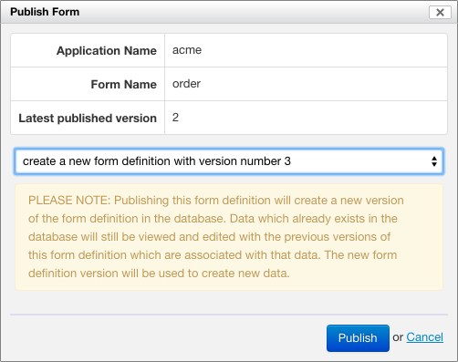
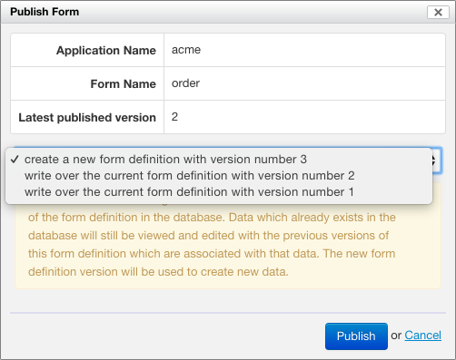

> [[Home]] ▸ [[Form Builder|Form Builder]]

## Related pages

- [[Introduction|Form Builder ~ Introduction]]
- [[Summary Page|Form Builder ~ Summary Page]]
- [[The Form Editor|Form Builder ~ The Form Editor]]
- [[Toolbox|Form Builder ~ Toolbox]]
    - [[Repeated Grids|Form Builder ~ Repeated Grids]]
    - [[Metadata|Form Builder ~ Toolbox ~ Metadata]]
- [[Form Area|Form Builder ~ Form Area]]
- [[Validation|Form Builder ~ Validation]]
- [[Control Settings|Form Builder ~ Control Settings]]
- [[Section Settings|Form Builder ~ Section Settings]]
- [[Section Templates|Form Builder ~ Section Templates]]
- [[Creating Localized Forms|Form Builder ~ Creating Localized Forms]]
- [[Formulas|Form Builder ~ Formulas]]
- [[Itemset Editor|Form Builder ~ Itemset Editor]]
- [[PDF Production|Form Builder ~ PDF Production]]
    - [[PDF Templates|Form Builder ~ PDF Production ~ PDF Templates]]

## Introduction

The notion of _publishing_ is central to Form Builder/Form Runner.

* As a form author, you first work on a form definition in a special space where the form can be modified, saved, and tested.
* Once the form definition is ready, you _publish it_ to Form Runner.
* After that moment:
    * the form becomes available by form users for data entry
    * Form Builder is no longer part of the equation

## Versioning

When versioning is enabled, you have a choice, when publishing, of whether to create a new form version or to override an existing one.

[SINCE Orbeon Forms 4.11] You can overwrite not only the latest published version, but any previous version.

For details, see:

- [Form versioning](http://blog.orbeon.com/2014/02/form-versioning.html) blog post
- [Choosing the best versioning option when publishing a form](http://blog.orbeon.com/2015/01/choosing-best-versioning-option-when.html) blog post