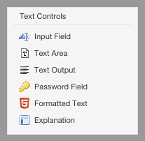
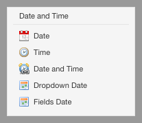
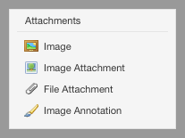
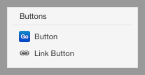

> [[Home]] ▸ [[Form Builder|Form Builder]]

The toolbox contains several categories:

* Global cut/copy/paste and "reload toolbox" icon buttons
* **Form controls**
    * New Section and New Grid buttons
    * User interface controls you can insert into your form
* **Metadata.** Allows you to modify the application name and form name.
* **Advanced.** Includes advanced features like XML Schema, PDF and source code view.
* **Services and Actions.** Editors for simple services and actions.

Depending on your monitor or browser size, you can use the scrollbar to the right of the toolbox to see more toolbox content.

These categories are detailed below.

## Cut, copy and paste

The Cut, Copy and Paste icons are located at the top of the toolbox:

They allow performing the usual cut/copy/paste operations on form controls.

* **Copy:** copies the control in the currently selected table cell to the Form Builder clipboard. If the cell is empty, nothing happens.
* **Cut:** same as Copy, but removes the control from the current grid cell. If the cell is empty, nothing happens.
* **Paste:** pastes the control in the Form Builder clipboard to the next available grid cell. If there is no control in the clipboard, nothing happens.

_NOTE: These operations are restricted to the currently running instance of Form Builder. They do not apply between different Form Builder windows or tabs, or between edition sessions._

The following control information is copied and pasted:

* Control type
* Name
* Label, hint, and help
* Itemset
* Validation settings including data type and constraints
* All associated localized resources

When the control is pasted, if the control name of the clipboard control is currently not in use in the form, it is used. Otherwise, a new name is chosen by Form Builder.

## User interface controls

The toolbox contains the user interface controls you can insert into your form, grouped by category:

* **Text controls.** Controls that just capture or show text.
* **Typed controls.** Controls that have type information associated, like email, phone number, attachments, etc.
* **Selection controls.** Controls that allow selecting one or more values, like dropdown menus, radio buttons, etc.
* **Other controls.** Currently this only includes buttons.
* **Section templates.** Custom controls representing a complete section.

To add a control to your form, simply click on the control. The following insertion logic is implemented:

* If the currently selected grid cell is empty, the control is inserted there.
* Otherwise, if the cell to the right of the currently selected grid cell is empty, the control is inserted there.
* Otherwise, if the control is the last control of the grid, a new grid row is inserted and the control is inserted in the first cell of the new row.
* Otherwise, the controls in the toolbox are disabled and you cannot insert a new control.

Controls appear in the grid in two ways:

* Most of the controls appear in a WYSIWYG manner.
* Some controls are represented just with an icon. This is the case of some controls such as phone number, currency fields, etc.
Orbeon is expecting feedback from users on the controls marked _experimental_ below.

## New section button

Pressing this button inserts a new section into the form. The section is inserted after the currently selected section, that is the section containing the currently selected control.

After insertion, the new section has an empty title. You can change the section title by clicking on it.

![][27]

## New grid button

Pressing this button inserts a new grid into the form. The grid is inserted after the currently selected grid within the currently selected section, that is the section and grid containing the currently selected control.

After insertion, the new grid has one column and one cell. You can change the dimensions of the grid using the grid icons.

## Text controls

The following text controls are available from the toolbox:

|     |     |
| --- | --- |
| **Input field** | A simple input field |
| **Password field** | An input field that hides the characters you type |
| **Text area** | Simple multi-line area |
| **Text output** | Like most other controls, the text output has a label, hint, but unlike most other control, the it can't be used by users to edit its value; instead, it just shows a value. It is intended to be used to display calculated values.  It can also be used to display a block of static text, like an explanation, by entering the text as the label of the control. The downside is that the text [has to be typed in a text field][29], which isn't appropriate for longer pieces of text and doesn't allow the text to be split in paragraphs. |
| **Formatted text** | A rich text editor, aka HTML editor |

Controls appear as follows in Form Builder:

![][30]

At runtime, with data captured:

![][31]

At runtime, in preview mode:

![][32]

![][33]

## Typed controls

## Date and time controls

## Selection controls

## Attachment controls

## Button controls

## TODO

The following text controls are available from the toolbox:

* Standard
    * **Date:** date field with date picker.
    * **Time:** time field.
    * **Date and Time:** date and time field.
    * **Email Address:** input field which validates that the content is an email address.
    * **Static Image:** image displayed on the form at design time. It is not possible to change the image at runtime.
    * **Image Attachment:** image which can be attached to the form at design time, but which can also be changed at runtime.
    * **File Attachment:** file which can be attached to the form at design time or at runtime. The file can also be replaced or downloaded once attached.
* Experimental
    * **Dropdown Date:** date chooser which uses dropdown menus.
    * **Fields Date:** date chooser which uses separate text fields.
    * **Date Picker:** date chooser which just uses a date picker.
    * **US Phone Number:** US phone number showing area code and number in separate fields.
    * **Dollars (Thousand):** field to capture dollars as thousands.

Controls appear as follows in Form Builder:

![][34]

At runtime, with data captured:

![][35]

At runtime, in preview mode:

![][36]

![][37]

## Selection controls

The following selection controls are available from the toolbox:

* Standard
    * **Dropdown** (single selection)
    * **Radio Buttons** (single selection)
    * **Checkboxes** (multiple selection)
    * **Single List Box** (single selection)
    * **Multi List Box** (multiple selection)
* Experimental
    * **Data Dropdown** (single selection dropdown bound to a service)
    * **Autocomplete** (single section with completion)
    * **Link Selector** (single selection with items shown as clickable links)

Controls appear as follows in Form Builder:

![][38]

At runtime, with data captured:

![][39]

At runtime, in preview mode:

![][40]

### Choices

You can edit the possible choices by clicking on the  ![][41]  icon that shows to the right of a control. When doing so, a dialog, like the one shown in the following screenshot, will appear.

![][42]

For each choice, you can enter:

* A _label_ – This is what users see when they fill out the form.
* A _value_ – This is what is stored as part of the data when users select this choice.
* A _hint_ – The third column only shows for radio buttons and checkboxes. If you provide a hint for a choice, that choice will be highlighted and the hint you provided will show when users move the mouse pointer over the label, as shown in the following screenshot.

![][43]

If you check the HTML checkbox, all the hints and labels you type in dialog are interpreted as HTML, allowing you to use HTML tags in label and hints, say to make text bold or italic.

![][44]

### Data dropdown

From the perspective of people who will be filling out your form, the data dropdown works just like a regular dropdown. However, the data in the dropdown comes from a service. For instance, imagine you have a list to select a state and that you don't want to hard code the list of states in the form, either for convenience, or because the subset of selectable states is dynamic:

1. Insert a data dropdown field.
2. Click on cogwheel to bring up a _Control Settings_ dialog, similar to the one shown to the right.
3. In the _Resource URI_, enter the address of an HTTP service that returns the data you want to use to populate the dropdown. In most cases, the URL will look like `http://your-host/your-service`. If the address you specify start with a `/`, it is relative to the Orbeon Forms web app, which allows you to access a service you might have implemented in Orbeon Forms with XPL. For this example, let's assuming your service returns a list of states that looks like:

``xml
<states>
    <state abbreviation="AK" name="Alaska"/>
    <state abbreviation="AL" name="Alabama"/>
    <state abbreviation="AR" name="Arkansas"/>
    ...
</states>
``
4. In the _Items_ field, enter an XPath expression that returns one node per state. In this case, it will be: `/states/state`.
5. For each state (_item_), specify an expression relative to the node returning the label (shown to users in the dropdown) and the value (stored in the data). In this case, those expressions will be, respectively: `@name` and `@abbreviation`.

If the data in the dropdown depends on a value entered by users in another form field, you can pass that value to the service as a request parameter. For instance, let's say that in addition to the _State_ dropdown, you have a _City_ dropdown where you want to list all the cities in the currently selected state. If the service is at `/xforms-sandbox/service/zip-cities` and takes a request parameter `state-abbreviation`, assuming you named your _State_ field `state`, in the _Resource URI_ enter:

``xml
/xforms-sandbox/service/zip-cities?state-abbreviation={$state}
``

[AS OF 2011-05-10] Limitation: you can't yet use a variable, as shown in the above example, to refer to another fields value. Instead, if the control is in the same section use `{state}`; if in a different section with name other-section, use `{../other-section/state}`.

![][45]

### Autocomplete

The autocomplete control is a single item selection control that loads a list of suggestions from a service. It takes the same _Resource URI_, _Items_, _Label_, and _Value_ configuration parameters as the [Data dropdown control][46]. You may want to pass the value of other controls to the service, but you'll always want to pass the currently typed value, as the suggestions should depend on what users typed so far. You access to the currently typed by value with `$fr-search-value`, as in the following example:

``xml
/xforms-controls/services/countries?country-name={`encode-for-uri($fr-search-value)}
``

![][47]

## Other controls

The following miscellaneous controls are available from the toolbox:

* **Button:** standard browser button.
* **YUI Button:** more stylish button with cross-browser appearance (based on the YUI library).

Controls appear as follows in Form Builder:

![][48]

At runtime:

![][49]

_NOTE: Buttons do not appear at all in preview mode._

Buttons do not allow entering data, and by default do nothing significant, but they can be used to trigger actions with the Action Editor.
