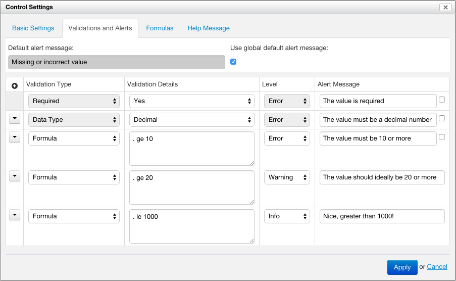

## Introduction

An important part of designing a form is to prevent incorrect data from being captured. For example:

- an applicant's first and last names might be required
- an applicant's age must be a positive number and might have to be greater than a minimum
- an id number might have to follow a specific syntax

If such conditions are not met, the user must see an *error* and cannot submit the data until they are corrected.

In addition, some values might be correct, but the user should be encouraged to pay special attention to them. In such cases, the user should see a *warning* or *informational message*.

Form Builder supports this kind of validations via the Validation Properties dialog. You open it with the Validation Properties icon to the right of each control.

## Validation types

The value associated with a control can be validated with 3 different validation types:

1. *Required*. This indicates whether the value can be empty or not.
2. *Data Type*. For example `string`, `decimal`, `date`, or `time`.
3. *Constraint*. A custom formula, expressed in XPath, which determines whether the value is valid or not.

Since Orbeon Forms 4.3, there can be more than one constraint applied to 

## 

