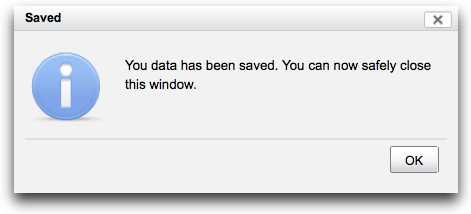

> [[Home]] ▸ Form Runner ▸ [[XBL Components|Form Runner ~ XBL Components]]

## Rationale

The alert dialog allows you to build simple dialogs for those cases where you need to inform users of something that happened, or ask a question which can be answered by a _yes_ or a _no_ .

## Example

Let's assume that you want to ask a yes/no question which produces a dialog as shown below, and that you want to react to users choosing _Yes_ .


First declare the dialog, with:

```xml
<fr:alert-dialog id="overwrite-file-dialog">
    <fr:label>Copy</fr:label>
    <fr:message>
        An item with the same name already exists.
        Do you want to replace it with the one you're moving?
    </fr:message>
    <fr:negative-choice/>
    <fr:positive-choice>
        <xf:toggle event="DOMActivate" case="replaced-case"/>
    </fr:positive-choice>
</fr:alert-dialog>
```

1. You gave an id to the dialog (`overwrite-file-dialog`).
2. You defined what the dialog title and message are with `<fr:label>` and `<fr:message>`.
3. You use the `<fr:negative-choice>` and `<fr:positive-choice>` elements to indicate which buttons you want to have, and in which order they should be shown.
4. You placed an event handler inside the `<fr:positive-choice``>`, which will run when/if users press the _Yes_ button.

You open this dialog by dispatching the event `fr-show` to the dialog:

```xml
<xf:dispatch target="overwrite-file-dialog" name="fr-show"/>
```

## Buttons

The alert dialog supports 3 buttons, that correspond to a _positive choice_ , a
_negative choice_ , and a _neutral choice_ . Each one has a default label and a default icon, as shown in the table below. For each button, you can:

* Override the label by placing your own `<fr:label>` inside the button element. For instance, you would change the label for positive choice from _Yes_ to _OK_ and for the negative choice from _No_ to _Cancel_ with:

    ```xml
    <fr:positive-choice><fr:label>OK</fr:label></fr:positive-choice>
    <fr:negative-choice><fr:label>Cancel</fr:label></fr:negative-choice>
    ```

* Override the icon shown inside the button with CSS. You will find an `<xhtml:span>` with the class indicated in the table below around each button, which allows you to have a different style depending on the button type. For instance, if you can use the following CSS rule to remove the icon for the positive choice button:

    ```xml
    .yui-skin-sam .xbl-fr-alert-dialog-positive .xbl-fr-button .yui-button button
        { background: none; padding: 0 10px 0 10px; }
    ```

| Element |  Default representation |  CSS class |
| --- | --- | --- |
| `<fr:positive-choice>` |  |  `xbl-fr-alert-dialog-positive` |
| `<fr:negative-choice>` |  |  `xbl-fr-alert-dialog-negative` |
| `<fr:neutral-choice>` |  |  `xbl-fr-alert-dialog-neutral` |

In most cases, you will be using either the positive and negative choice together, or the neutral choice alone. You can use the 3 buttons at the same time, to create a _Yes-No-Cancel_ type of dialog. In this case however, you should consider giving labels to buttons that more description than _Yes-No-Cancel_ . For instance, if you want to ask users whether they want to leave this form without saving, you could label the buttons _Save data_ , _Discard data_ , _Continue editing_ .

## Actions

You specify the actions running upon a button being pressed by either:

* **Use inline actions** – Placing the actions inside the `<fr:``positive-choice``>` or <fr:negative-choice> or <fr:neutral-choice>, and run them on the `DOMActivate` event, as done in the example above.
* **Use a "callback"** – [SINCE 2011-07-22] When opening the alert dialog, passing the id of an element to which the dialog will dispatch an event upon a button being pressed. For instance you would open the dialog with:

    ```xml
    <xf:trigger id="delete-trigger">
        <xf:label>Delete</xf:label>
        <xf:dispatch target="confirm-deletion-dialog" name="fr-show">
            <xf:property name="positive-targetid" value="'delete-trigger'"/>
        </xf:dispatch>
        <xf:action event="fr-positive">
            <!-- Operation to perform upon delete -->
        </xf:action>
    </xf:trigger>
    ```

_You pass the element id using the context property named `positive-targetid`, `negative-targetid`, or `neutral-targetid`. Then, the alert dialog dispatches an event named `fr-positive`, or `fr-negative`, or `fr-neutral` to that element. This second technique is particularly useful when you want to have one instance of an alert dialog that you want to reuse from the multiple places in your form._

_**Keeping context information** – [SINCE 2012-09-26] When opening the dialog you can pass an optional context property named `context`; the value of this property must be a string, and it will be passed back to your handler for `fr-positive`, or `fr-negative`, or `fr-neutral`. This is particularly useful when you want to "forward" an event property to your custom handler. For instance you can open the dialog with:_

```xml
<xf:dispatch target="confirm-deletion-dialog" name="fr-show">
    <xf:property name="positive-targetid" value="'delete-trigger'"/>
    <xf:property name="context" value="event('patient-condition')"/>
</xf:dispatch>
```

_And then in your handler access the value you originally passed, as in:_

```xml
<xf:action event="fr-positive">
    <xf:delete ref="instance('patient-conditions')/condition[@id = event('context')]"/>
</xf:action>
```

_NOTE: Before Orbeon Forms 4.0, use `xxf:context` instead of `xf:property`._

## Dynamic message

Instead of specifying an inline message with `fr:message`, you can pass it dynamically when opening the dialog:

```xml
<xf:dispatch target="confirm-deletion-dialog" name="fr-show">
    <xf:property name="message" value="'Are you sure you want to proceed?'"/>
</xf:dispatch>
```

_NOTE: Before Orbeon Forms 4.0, use `xxf:context` instead of `xf:property`._

##  Dialog icon

Depending on the number of buttons you place in your dialog, a different icon is used next to the message. Just like icons in buttons, you can change the icon by overriding the default CSS:

* When you have 2 or 3 buttons, the dialog is considered to be a **question**. The CSS class is `xbl-fr-alert-dialog-question` and the dialog looks like:

    

* When you have 1 button, the dialog is considered to be **informational**. The CSS class is `xbl-fr-alert-dialog-info` and the dialog looks like:

    
