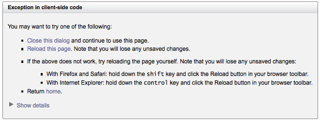

# Client-side error handling

<!-- toc -->

## Disabling the standard error dialog

By default, when an Ajax error happens, Orbeon Forms shows users an error dialog.



You can disable this behavior by adding this property to your `properties-local.xml`:

```xml
<property
    as="xs:boolean"
    name="oxf.xforms.show-error-dialog"
    value="false">
```

## JavaScript event handler

Orbeon Forms exposes a custom JavaScript event: `ORBEON.xforms.Events.errorEvent`. You can register your own listener on that event, and when fired, send users to a page you choose, as done in the following snippet, which sends users to the Orbeon home page:

```javascript
ORBEON.xforms.Events.errorEvent.subscribe(function(eventName, eventData) {
    // your code here
});
```

### Example

In case the user session expires, or some other error happens, you would like to redirect them a page you created that will, for instance, tell users to log in and try again, and if the problem persists to contact customer support.

```javascript
ORBEON.xforms.Events.errorEvent.subscribe(function(eventName, eventData) {
    window.location.href = "http://www.example.org/";
});
```

## Providing your own dialog

By default, the source markup for this dialog is available under:

```
oxf:/config/error-dialog.xml
```

This file is located in `orbeon-resources-private.jar`.

You can override it in two ways:

* Globally, by placing your own `error-dialog.xml` file under `WEB-INF/resources/config`.
* Per application, by placing your own `error-dialog.xml` file under `WEB-INF/resources/apps/$app`, where `$app` stands for the name of your application.

### Example: default dialog

The default dialog provides classes allowing for opening/closing a details section:

```xml
<div xmlns="http://www.w3.org/1999/xhtml" class="xforms-error-dialogs">
    <div class="xforms-error-panel xforms-initially-hidden" role="dialog" aria-labelledby="error-dialog-title">
        <div class="hd" id="error-dialog-title">An error has occurred</div>
        <div class="bd">
            <p>
                You may want to try one of the following:
            </p>
            <ul>
                <li><a class="xforms-error-panel-close">Close this dialog</a> and continue to use this page.</li>
                <li><a class="xforms-error-panel-reload">Reload this page</a>. Note that you will lose any unsaved changes.</li>
                <li>
                    <p>
                        If the above does not work, try reloading the page yourself. Note that you will lose any unsaved changes:
                    </p>
                    <ul>
                        <li>
                            With Firefox: hold down the <code>shift</code> key and click the Reload button in your browser toolbar.
                        </li>
                        <li>
                            With Safari and Chrome: click the Reload button in your browser toolbar.
                        </li>
                        <li>
                            With Internet Explorer: hold down the <code>control</code> key and click the Reload button in your browser toolbar.
                        </li>
                    </ul>
                </li>
                <li>Return <a href="/">home</a>.</li>
            </ul>
            <div class="xforms-error-panel-details-hidden">
                <p>
                    <a class="xforms-error-panel-show-details">
                        
                        <span>Show details</span>
                    </a>
                </p>
            </div>
            <div class="xforms-error-panel-details-shown xforms-disabled">
                <p>
                    <a class="xforms-error-panel-hide-details">
                        
                        <span>Hide details</span>
                    </a>
                </p>
                <div class="xforms-error-panel-details"/>
            </div>
        </div>
    </div>
    <div class="xforms-login-detected-dialog modal hide fade" tabindex="-1" role="dialog" aria-hidden="true">
        <div class="modal-header">
            <h4>Reloading form</h4>
        </div>
        <div class="modal-body">
            <p>
                This form has to be reloaded. This most likely happened because your session has expired, which might
                take to the login page. (If you think that you shouldn't see this message and that the problem persists,
                please contact support.)
            </p>
        </div>
        <div class="modal-footer">
            <button class="btn btn-primary">OK</button>
        </div>
    </div>
</div>
```

### Example: minimal dialog

At a minimum, the file should contain the following structure:

```xml
<div xmlns="http://www.w3.org/1999/xhtml"
     class="xforms-error-panel xforms-initially-hidden">
    <div class="hd">An error has occurred</div>
    <div class="bd">
        <p>
            Sorry, a serious error has occurred!
        </p>
        <div class="xforms-error-panel-details-hidden xforms-disabled">
            <p>
                <a class="xforms-error-panel-show-details"/>
            </p>
        </div>
        <div class="xforms-error-panel-details-shown xforms-disabled">
            <p>
                <a class="xforms-error-panel-hide-details"/>
            </p>
            <div class="xforms-error-panel-details"/>
        </div>
    </div>
</div>
```


### CSS configuration

Advanced developers can configure the appearance of the error dialog. In most cases overriding CSS definitions should be enough.