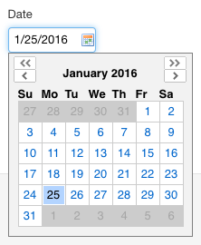
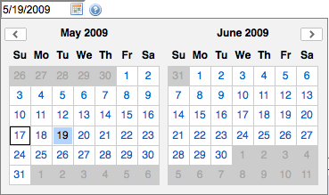
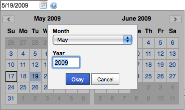

# XForms configuration properties

<!-- toc -->

## Default values

For the latest default values of XForms properties, see [`properties-xforms.xml`](https://github.com/orbeon/orbeon-forms/blob/master/src/resources-packaged/config/properties-xforms.xml).

## Encryption and passwords

### Encryption password

Before Orbeon Forms 4.0, the `oxf.xforms.password` property was defined. It has since been renamed `oxf.crypto.password`. For more information, see [General Configuration Properties](../../configuration/properties/general.md). `oxf.xforms.password` is still supported for backward compatibility.

### XForms items encoding

With Orbeon Forms 4.0, XForms item values (like in checkboxes, dropdown menus, etc.) are no longer encrypted, but they are encoded by position. The following property can be used to enable or disable this behavior:

```xml
<property
  as="xs:boolean"
  name="oxf.xforms.encrypt-item-values"
  value="true"/>
```

In general, this should be set to `true`, but you can set it to `false` if you need to access the value of selection controls through JavaScript on the client and if the item values are not confidential.

## XPath analysis

See [XPath Analysis](http://wiki.orbeon.com/forms/doc/developer-guide/xforms-xpath-analysis).

## File location information

[SINCE Orbeon Forms 4.4]

The following property specifies whether the XForms engine should keep file location formation:

```xml
<property 
    as="xs:string" 
    name="oxf.xforms.location-mode" 
    value="none"/>
```

If the value is `smart`, location data is kept.

Default:

- prod mode: `none`
- dev mode: smart

Keeping location data is useful during development. However, this consumes more memory, especially for very large forms.

_NOTE: Before Orbeon Forms 4.4, location data was always kept._

## Submission

The following property controls some aspects of XForms submission in Orbeon Forms:

```xml
<property 
    as="xs:boolean" 
    name="optimize-get-all" 
    value="true"/>
```

- If set to `true` (the default), Orbeon Forms optimizes submissions with replace="all" and the get method by sending URL of the submission action directly to the web browser. This however means that submission errors cannot be caught by XForms event handlers after Orbeon Forms has started connecting to the submission URL, as should be the case following the XForms specification.
- If set to `false`, Orbeon Forms buffers the reply so that errors can be handled as per XForms. However, this solution is less efficient.

The following two properties control optimized XForms submissions:

```xml
<property 
    as="xs:boolean" 
    name="oxf.xforms.oxf.xforms.local-submission-forward" 
    value="true"/>
```

- If set to `true` (the default), Orbeon Forms optimizes "local" (i.e. submissions performed to a URL controlled by Orbeon Forms itself) submissions with replace="all", by using the Java Servlet API's forward capability instead of actually performing an HTTP request.
- If set to `false`, Orbeon Forms always always uses the HTTP or HTTPS protocol (or other protocol specified), which is less efficient but more flexible.

```xml
<property 
    as="xs:boolean" 
    name="oxf.xforms.oxf.xforms.local-submission-include" 
    value="false"/>
```

- If set to `true` (the default is false), Orbeon Forms optimizes "local" (i.e. submissions performed to a URL controlled by Orbeon Forms itself) submissions with replace="instance", replace="text" or replace="none", by directly using the Java Servlet API's include capability instead of actually performing an HTTP request.
- If set to `false`, Orbeon Forms always always uses the HTTP or HTTPS protocol (or other protocol specified), which is less efficient but more flexible.


## Instance inclusion

The following property controls optimized instance inclusion:

```xml
<property 
    as="xs:boolean" 
    name="oxf.xforms.local-instance-include" 
    value="false"/>
```

- If set to `true` (the default is false), Orbeon Forms optimizes "local" (i.e. submissions performed to a URL controlled by Orbeon Forms itself) instance inclusions, by directly using the Java Servlet API's include capability instead of actually performing an HTTP request.
- If set to `false`, Orbeon Forms always always uses the HTTP or HTTPS protocol (or other protocol specified), which is less efficient but more flexible.

Note that for any optimized submission or inclusion to occur, the following is required:

- URL must be an absolute path, e.g. /foo/bar. Using an explicit protocol (`http://foo.com/bar`) disables optimized submissions.
- No  elements must be passed.
- The submission must be synchronous.


## Instance data types

The following property controls whether instance types annotations are exposed to XPath 2.0 expressions:

```xml
<property 
    as="xs:boolean" 
    name="oxf.xforms.expose-xpath-types" 
    value="true"/>
```

- If set to `false` (the default), instance types are not made available to XPath expressions.
- If set to `true`, they are made available.

More information: [XPath 2.0 support][2].

## JavaScript and CSS Resources

The following properties are documented in a [separate page](http://wiki.orbeon.com/forms/doc/developer-guide/xforms-javascript-css-resources):

- `oxf.xforms.minimal-resources`
- `oxf.xforms.combine-resources`
- `oxf.xforms.resources.baseline`
- `oxf.xforms.cache-combined-resources`

## Noscript mode

The following property controls whether noscript mode is enabled:

```xml
<property 
    as="xs:boolean" 
    name="oxf.xforms.noscript" 
    value="false"/>
```


The following property controls whether noscript mode is supported:

```xml
<property 
    as="xs:boolean" 
    name="oxf.xforms.noscript-support" 
    value="true"/>
```

The noscript mode is enabled only if both properties are true.

_NOTE: The reason there are two properties is that in the future, the XForms engine might be able to determine by itself whether noscript mode is enabled based on what controls and XBL components are in use._

## Controls

### XForms 1.1-compatible of switch/case

[XForms 1.1 specifies](http://www.w3.org/TR/xforms/#ui-switch-module) that a non-visible case behaves as non-relevant.

a property allows enabling XForms 1.1-compatible behavior. (Orbeon Forms did not support this previously and considered that non-visible cases were hidden but still relevant.)

```xml
<property 
    as="xs:boolean" 
    name="oxf.xforms.xforms11-switch" 
    value="true"/>
```

You can also set this property on a per-switch basis:

```xml
<xforms:switch xxforms:xforms11-switch="true">
    ...
</xforms:switch>
```

This property also applies in a similar way to hidden dialogs.

NOTE: In the future, it is expected that:

- This will be enabled by default to be XForms 1.1-compliant out of the box.
- Setting the property to `false` will revert to the pre-March 2010 behavior, as there are cases where keeping hidden cases relevant makes sense.

### Label, help, hint, alert (LHHA) elements

By default, LHHA elements are represented as follows:

- `<xf:label>` use the HTML `<label>` element
- `<xf:hint>` use the HTML `<span>` element
- `<xf:help>` use the HTML `<span>` element
- `<xf:alert>` use the HTML `<span>` element

You can configure the following properties in your `properties-local.xml` to change the default configuration:

```xml
<property as="xs:string" name="oxf.xforms.label-element" value="label"/>
<property as="xs:string" name="oxf.xforms.hint-element"  value="span"/>
<property as="xs:string" name="oxf.xforms.help-element"  value="span"/>
<property as="xs:string" name="oxf.xforms.alert-element" value="span"/>
```

If an element is configured to be a label, a `for` attribute pointing to the control is set by the XForms engine.

### Order of control and LHHA elements

The following property controls the order of label, help, hint, alert, and control elements output by the XForms engine:

```xml
<property 
    as="xs:string" 
    name="oxf.xforms.order" 
    value="label control help alert hint"/>
```

The property uses the order of the predefined tokens `label`, `control`, `help`, `alert`, and `hint` to set the order.

The order applies to most controls, such as `<xf:input>`, etc. Some specific control or appearances do not use this property:

- `<xxf:dialog>`
- `<xf:group appearance="xxf:fieldset">`

Individual controls also support this property locally:

```xml
<xf:input xxf:order="label help control hint alert">
```

### Two months view

By default, YUI date picker shows as follows:



You can set the `oxf.xforms.datepicker.two-months` property to `true`, and the date picker will show two months at a time:



By default, the property is set to `false`, (only one month is shown). You can override by adding the following to your `properties-local.xml`:

```xml
<property 
    as="xs:boolean" 
    name="oxf.xforms.datepicker.two-months" 
    value="false"/>
```

### Navigator

With the `oxf.xforms.datepicker.navigator` property set to `true` (the default), when you click on the month headers, a small dialog allows you to type a year and select a month from a drop-down. This is particularly convenient if the date you want to capture has a chance to be further in the future or in the past (such as a birth date).



You disable the navigator by setting the following property to `false` (it is `true` by default):

```xml
<property 
    as="xs:boolean" 
    name="oxf.xforms.datepicker.navigator" 
    value="false"/>
```

### Upload

When you use an `<xf:upload>` control, as soon users select a file, the file is uploaded in the background from the browser to Orbeon Forms. While the file is
 uploaded, a progress bar is show in the browser, in place of the file selection control, as in this screenshot:


To know how much of the file has been uploaded so far, the browser sends an Ajax request to the server, at a regular interval, asking the server what
 percentage of the file it has received. By default, the browser sends a request every 2 seconds. You can change this by overriding the following property.
 You set the value of this property as a compromise: low enough so the progress bar updates at a regular interval giving users a more accurate indication of how far along they are in the upload, and high enough to limit the number a queries made to Orbeon Forms, and thus limit the load on the server.

```xml
<property
    as="xs:integer"
    name="oxf.xforms.delay-before-upload-progress-refresh"
    value="2000"/>
```

## XForms inspector

You can enable the [XForms Inspector][7] for all the page in your site by setting the following property to `true` (the default is `false`):

```xml
<property 
    as="xs:boolean" 
    name="oxf.epilogue.xforms.inspector" 
    value="true"/>
```

## Appearance of radio buttons and checkboxes in review and PDF modes

[SINCE Orbeon Forms 4.6]

Since Orbeon Forms 4.5, radio buttons and checkboxes in review and PDF modes (or for any static-readonly control appearance) shows all items as checkboxes (see the [blog post][8]).

If you don't like this behavior, you can set the following two properties:

```xml
<!-- For checkboxes -->
<property 
    as="xs:string" 
    name="oxf.xforms.readonly-appearance.static.select"  
    value="minimal"/>
    
<!-- For radio buttons -->
<property 
    as="xs:string" 
    name="oxf.xforms.readonly-appearance.static.select1" 
    value="minimal"/>
```

These cause the radio buttons and checkboxes to display only the values selected, as text, like for dropdown menus and other section controls.

## Formatting

### For xf:output

When an `<xf:output>` is bound to a node and that node has a type, the type influences the formatting of the value. For instance, if the node has a type
 `xs:date`, instead of being shown as "2009-03-11", the value might be shown as "Wednesday March 11, 2009".

_NOTE: This also applies to `<xf:input>` in static readonly mode._

Out of the box, Orbeon Forms formats differently values of different types. You can change how values are formatted by setting the properties below.
The value of each property is an XPath expression executed on the node bound to the `<xf:output>`. The XPath expression is expected to return a string
containing the value which will be shown to the user.

```xml
<property as="xs:string" name="oxf.xforms.format.output.date"     value="..."/>
<property as="xs:string" name="oxf.xforms.format.output.dateTime" value="..."/>
<property as="xs:string" name="oxf.xforms.format.output.time"     value="..."/>
<property as="xs:string" name="oxf.xforms.format.output.decimal"  value="..."/>
<property as="xs:string" name="oxf.xforms.format.output.integer"  value="..."/>
<property as="xs:string" name="oxf.xforms.format.output.float"    value="..."/>
<property as="xs:string" name="oxf.xforms.format.output.double"   value="..."/>
```

Here are some examples of outputs with the default properties:

- `2004-01-07`
    - `xs:date`
    - Wednesday January 7, 2004
- `2004-01-07T04:38:35.123`
    - `xs:dateTime`
    - Wednesday January 7, 2004 04:38:35 UTC
- `04:38:35.123`
    - `xs:time`
    - 04:38:35 UTC
- `123456.789`
    - `xs:decimal`
    - 123,456.79
- `123456.789`
    - `xs:integer`
    - 123,456
- `123456.789`
    - `xs:float` or `xs:double`
    - 123,456.789

The default formatting properties for `date`, `time`, and `dateTime` now use the current language by the `xxforms:lang()` function, for example:

```xml
<property as="xs:string"  name="oxf.xforms.format.output.date">
    if (. castable as xs:date) then format-date(xs:date(.), '[FNn] [MNn] [D], [Y]', xxf:lang(), (), ()) else .
</property>
```

This means that the language that is used for the formatting is the language in effect where the control is in used, via the `xml:lang` attribute.

### For xf:input

As for `<xf:output>`, values shown by `<xf:input>` depend on the type of the node bound to the `<xf:input>`. In this case however the `<xf:input>` must be able
to not only show a value coming from an instance in a text field, but also parse a new value in that format typed in by users in the text field. Because the
`<xf:input>` is able to both format and parse values, what you can do with an `<xf:input>` is more restrictive compared to what you can do with an `<xf:output>`.

You can configure formatting for `<xf:input>` with the two properties below. The value is a "mask" and follows the syntax of the Java [SimpleDateFormat][9].
The following masks are supported:

- For dates (property `oxf.xforms.format.input.date`):
    - `[M]/[D]/[Y]` e.g. 11/5/2008 (also called "North America format")
    - `[D]/[M]/[Y]` e.g. 5/ 11/2008 (also called "European format")
    - As a variation, you can use another separator such as a dot (e.g. `[D].[M].[Y]`) or dash (`[D]-[M]-[Y]`)
    - As a variation, you can write `[M01]` and `[D01]` if you want day and months on one digit to be prefixed with a `0`, e.g. 11/05/2008
- For times (property `oxf.xforms.format.input.time`):
    - `[h]:[m]:[s] [P]` e.g. 2:05:12 p.m. with dots in a.m. and p.m.
    - `[h]:[m]:[s] [P,2-2]` e.g. 2:05:12 pm without dots in am and pm
    - `[H]:[m]:[s]` e.g. 14:05:12
    - `[H]:[m]` e.g. 14:05 (without seconds)

An `<xf:input>` bound to a node of type `xs:dateTime` is shown as two text fields: one for the date and one for the time. In that case, the date text field
uses the formatting defined by `oxf.xforms.format.input.date` and the time text field uses the formatting defined by `oxf.xforms.format.input.time`.

```xml
<property as="xs:string" name="oxf.xforms.format.input.date" value="[M]/[D]/[Y]"/>
<property as="xs:string" name="oxf.xforms.format.input.time" value="[h]:[m]:[s] [P]"/>
```

##  Error handling

See [XForms Error Handling](../../xforms/error-handling.md).

## Automatic inclusion of XBL bindings

If you write your own XBL components, you need to include the XBL in every page that uses them. To avoid this, you can define a mapping between the namespace in which your XBL components are, and a directory containing the XBL file. Then, following some naming conventions (more on this below), your XBL will be automatically found by Orbeon Forms, without you having to explicitly include it in every page that uses it.

Properties starting with `oxf.xforms.xbl.mapping` specify a mapping between directory name an a URI:

```xml
<property
  as="xs:string"
  name="oxf.xforms.xbl.mapping.acme"
  value="http://www.acme.com/xbl"/>
```

Consider an example, with the property above set:

1. Say element `<acme:button>` is found by the XForms engine, in your own `http://www.acme.com/xbl` namespace
2. Orbeon Forms looks for a property with a name that starts with `oxf.xforms.xbl.mapping` and with a value is equal to the namespace in question
   (here `http://www.acme.com/xbl`). In this case it finds the property `oxf.xforms.xbl.mapping.acme`.
3. Orbeon Forms extracts the part of the property name after `oxf.xforms.xbl.mapping`. In this case it is: `acme`.
4. This is used to resolve a resource called `oxf:/xbl/acme/button/button.xbl`.
    - The first part of the path is always `xbl`.
    - This is followed by the directory name found in step 3, here: `acme`.
    - This is followed by a directory with the same name as the local name of your component, containing an XBL file also with the same name as your component, here: `button/button.xbl`.
5. The resource, if found, is automatically included in the page for XBL processing

By default, all the `<fr:*>` elements are handled this way, and a mapping is already defined for those components.

## Ajax requests

### Retry mechanism for Ajax requests

Orbeon Forms relies on client-side code (running on the browser) communicating with server-side code (running on your application server). As needed, the
client sends a request to the server. In case of communication failure or if the client does not receive an answer from the server after a given timeout,
then the client resends the request. The default value of the timeout for Ajax requests is 30 seconds. You can change this value by setting the following
property. A value of `-1` disables the retry mechanism.

```xml
<property 
    as="xs:integer" 
    name="oxf.xforms.delay-before-ajax-timeout" 
    value="30000"/>
```

The first time the client retries to send a request, it does so right away. However, the second time it waits for 5 seconds, the third time for 10 seconds,
the fourth time for 15 seconds, and so on, until it reaches a maximum delay between retries of 30 seconds. You can configure the "delay increment" (by default
 5 seconds) and the "maximum delay" (by default 30 seconds) with the following properties:

```xml
<property 
    as="xs:integer" 
    name="oxf.xforms.retry.delay-increment"     
    value="5000"/>
<property 
    as="xs:integer" 
    name="oxf.xforms.retry.max-delay"           
    value="30000"/>
```

Orbeon Forms handles the case where a request was successfully received and executed by the server, but the response didn't make it to the client.
In those cases, the client resends the request to the server. The server detects that this particular request has been already executed, so it doesn't
execute it again, and instead resends the same response that was generated the first time around.

### Login page detection

[SINCE Orbeon Forms 4.5]

You can set the following property to a regexp. When set to a non-empty value, if an Ajax request get an unexpected page which isn't an Orbeon Forms error
and matches the regexp, users will be notified, and Orbeon Forms will reload the form, which in turn is likely to take them to the login page. By default,
this property is set to the empty string, meaning that Orbeon Forms doesn't try to detect login pages, and always retries Ajax requests met with an unexpected
 response that aren't Orbeon Forms error pages. For some background on this, see our blog post [Detecting login pages in Ajax requests][10].

```xml
<property 
    as="xs:string"  
    name="oxf.xforms.login-page-detection-regexp"  
    value=""/>
```

## Preprocessing step

The XForms engine supports a preprocessing step. By default, this step is disabled. You can enable it with the following properties:

```xml
<property 
    as="xs:boolean" 
    name="oxf.epilogue.xforms.preprocessing" 
    value="true"/>
    
<property as="xs:anyURI"
    name="oxf.epilogue.xforms.preprocessing.uri"
    value="oxf:/my/preprocessing/pipeline.xpl"/>
```

The second property must point to an XPL file with a `data` input and data output. The pipeline can transform the incoming XForms.

## ARIA support in dialogs

If your forms leverage dialogs and your users are likely to use a screen reader, you might want to enable the support for [ARIA][11] in dialogs by setting
 the following property to `true`. By default, the property is set to `false`, as enabling it has a cost in performance on IE.

```xml
<property as="xs:boolean" name="oxf.xforms.use-aria" value="false"/>
```

[2]: http://wiki.orbeon.com/forms/doc/developer-guide/xpath-2-0-support
[7]: http://wiki.orbeon.com/forms/doc/developer-guide/xforms-xforms-inspector
[8]: http://blog.orbeon.com/2014/03/review-and-pdf-improvements.html
[9]: http://java.sun.com/javase/6/docs/api/java/text/SimpleDateFormat.html
[10]: http://blog.orbeon.com/2013/12/detecting-login-pages-in-ajax-requests.html
[11]: http://www.w3.org/TR/wai-aria/
