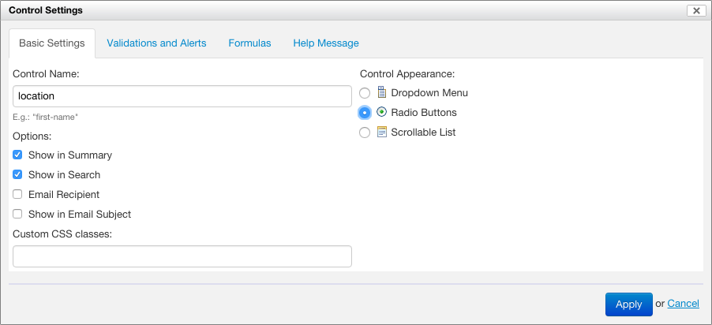
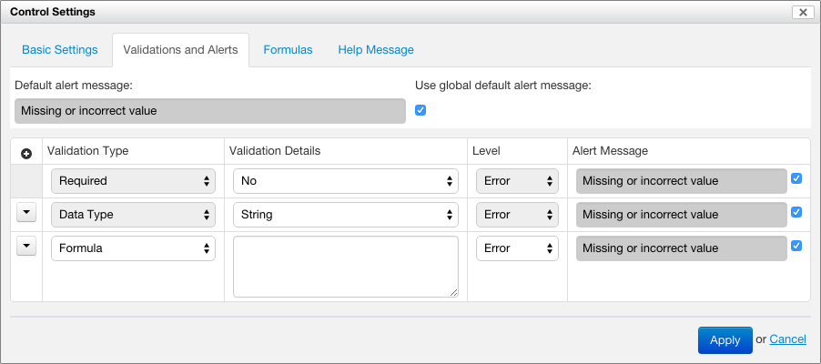
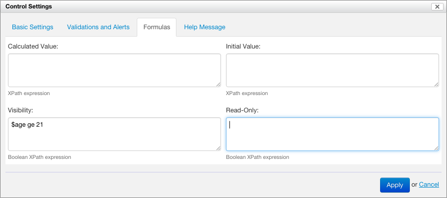
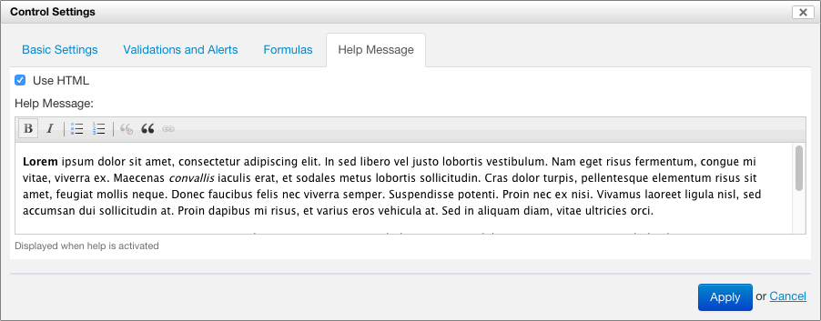

# Control settings

<!-- toc -->

## Introduction

The Control Details dialog allows controlling all the aspects the a control besides its label and hint. The dialog
has several tabs, detailed below.

### Basic Settings

#### Basic options

The control *name* specifies a identifier for the control, unique in the entire form (except [[Section Templates|Form-Builder ~ Section Templates]]). The
identifier is used for the following:

- to refer to the control value from formulas
- to determine the name when the form data is represented as XML

If no control name is explicitly specified, Form Builder assigns a default name, such as `control-42`.

The following options are available:

- __Show in Summary:__ when selected, the control value is visible as a summary page column
- __Show in Search:__ when selected, the control value is searchable in the summary page
- __Email Recipient:__ when selected, the control is used to determine an email recipient when the form data is sent by email
- __Show in Email Subject:__ when selected, the control value is used as part of the subject of the email when the form data is sent by email

The "Custom CSS Classes" field allows adding CSS classes which will be placed on the control in the resulting HTML.

#### Control appearance

[SINCE Orbeon Forms 4.10]

Some controls support more than one appearance. For example, a single selection control can appear as a dropdown menu,
or as radio buttons. When available, the "Control Appearance" selector allows selecting and changing the appearance of
the control.

See also [How the new Form Builder Appearance Selector Works](http://blog.orbeon.com/2015/06/how-new-form-builder-appearance.html).

### Validations and alerts

See [[Form Builder Validation|Form Builder ~ Validation]] for details.

### Formulas

See [[Form Builder Formulas|Form Builder ~ Formulas]] for details.

### Help Message

This allows specifying some help text, which can be plain text or rich text when the "Use HTML" checkbox is selected.

The help message is available at runtime through a help icon positioned next to the control. By default, the icon opens a pop-up containing the help text. In *noscript* mode, the icon links to a help section at the bottom of the form.

The help text is localizable.

See also [Improving how we show help messages](http://blog.orbeon.com/2014/01/improving-how-we-show-help-messages.html).

## See also

- [[Form Builder Validation|Form Builder ~ Validation]]
- [Enhanced validation in Form Builder and Form Runner](Enhanced validation in Form Builder and Form Runner)
- [[Form Builder Formulas|Form Builder ~ Formulas]]
- [Improving how we show help messages](http://blog.orbeon.com/2014/01/improving-how-we-show-help-messages.html)
- [How the new Form Builder Appearance Selector Works](http://blog.orbeon.com/2015/06/how-new-form-builder-appearance.html)