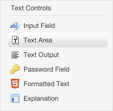
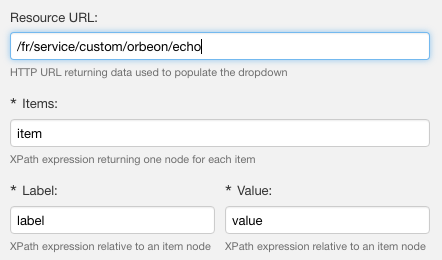

# XBL Components Metadata

## Rationale

XBL components can be loaded by the Form Builder toolbox. In order for Form Builder to have information about those components, metadata can be added to each XBL binding.



## Namespace

The Form Builder specific extensions are in an namespace::

- URI: `http://orbeon.org/oxf/xml/form-builder`
- Usual prefix: `fb`
- Example: `xmlns:fb="xmlns="http://orbeon.org/oxf/xml/form-builder"`

## Group metadata for the toolbox

In XBL, each component is defined in an `<xbl:binding>` element and multiple `<xbl:binding>` can be grouped under an `<xbl:xbl>` element. The Form Builder toolbox shows components, grouped by "types of components", e.g. "Text Controls", as shown at the right of this text. To instruct Form Builder that multiple component should be grouped together in the toolbar, place then inside the same `<xbl:xbl>`. Then, as a child element of `<xbl:xbl>`, you provide the title for the group inside an `<fb:metadata>`, as in (see the [full source][1]):

```xml
<fb:metadata>
    <fb:display-name lang="en">Text Controls</fb:display-name>
    <fb:display-name lang="fr">Contrôles texte</fb:display-name>
</metadata>
```

## Control metadata for the toolbox

To be used in Form Builder, your XBL component must have an additional `<fb:metadata>` section inside the `<xbl:binding>` of your component. That `<fb:metadata>` provides to Form Builder the localized display name for the component, an icon, and the markup to be inserted by Form Builder into the form when the component is used. For instance, the `<metadata>` section for the [date picker][2] component look like (see the [full source][3]):

```xml
<fb:metadata xmlns="http://orbeon.org/oxf/xml/form-builder">
    <fb:display-name lang="en">Date Picker</fb:display-name>
    <fb:display-name lang="fr">Sélecteur de date</fb:display-name>
    <fb:icon lang="en">
        <fb:small-icon>/apps/fr/style/images/silk/date.png</fb:small-icon>
        <fb:large-icon>/apps/fr/style/images/silk/date.png</fb:large-icon>
    </fb:icon>
    <!-- Other metadata information -->
</fb:metadata>
```

## Control metadata for the markup to insert in the form

When form authors add an instance of your component from Form Builder, Form Builder needs to… well, add the component to the form. For this, inside the `<fb:templates>` for your component you declare:


- Inside `<fb:view>`, the markup that goes in the view, e.g. `<xf:input>` for a plain XForms input.
- Optionally, on `<fb:bind>`, attributes you might want to add to the `<xf:bind>` Form Builder adds for your component.
- Optionally, and this is rare, inside `<fb:resources>`, additional resource elements the component might use, in addition to the `label`, `help`, `hint`, and `alert`. E.g. this is used in [explanation.xbl](https://github.com/orbeon/orbeon-forms/blob/master/src/resources-packaged/xbl/orbeon/explanation/explanation.xbl).

```xml
<fb:templates>
    <fb:view>
        <my:component>
            <xf:label ref=""/>
            <xf:hint ref=""/>
            <xf:help ref=""/>
            <xf:alert ref=""/>
        </my:component>
    </fb:view>
    <fb:bind type="xf:decimal"/>
    <fb:resources>
        <text/>
    </fb:resources>
</fb:templates>
```

If your component only needs a template for the view, which is maybe the most frequent use case, instead of nesting an `<fb:view>` inside an `<fb:templates>`, you can just use an `<fb:template>` element, as in:

```xml
<fb:template>
    <my:component>
        <xf:label ref=""/>
        <xf:hint ref=""/>
        <xf:help ref=""/>
        <xf:alert ref=""/>
    </my:component>
</fb:template>
```

## Control metadata for the Edit Control Details dialog



All the controls share certain properties, like the control name. However, some XBL components take additional properties, set at form design time, in Form Builder. For instance the [[Dynamic Data Dropdown|Form Runner ~ XBL Components ~ Dynamic Data Dropdown]] takes the HTTP URI of a service returning an XML document with the items shown in the drop-down, an XPath expression extracting the items from the XML document, and two XPath expressions returning the label and value for each item.


When your XBL component takes additional "properties", you want Form Builder users to be able to set them in from the Edit Control Details dialog. For this, inside the `<fb:metadata>` add an `<fb:control-details>`, which contains XForms control used to edit those properties, as in:

```xml
<fb:control-details>
    <xf:input ref="@resource">
        <xf:label lang="en">Resource URL</xf:label>
        <xf:label lang="fr">URL de la ressource</xf:label>
        <xf:hint lang="en">HTTP URL returning data used to populate the dropdown</xf:hint>
        <xf:hint lang="fr">URL HTTP auquel réside le service</xf:hint>
    </xf:input>
    <xf:input ref="xf:itemset/@ref">
        <xf:label ref="$resources/dialog-actions/items/label"/>
        <xf:hint ref="$resources/dialog-actions/items/hint"/>
    </xf:input>
    <xf:input ref="xf:itemset/xf:label/@ref">
        <xf:label ref="$resources/dialog-actions/item-label/label"/>
        <xf:hint ref="$resources/dialog-actions/item-label/hint"/>
    </xf:input>
    <xf:input ref="xf:itemset/xf:value/@ref">
        <xf:label ref="$resources/dialog-actions/item-value/label"/>
        <xf:hint ref="$resources/dialog-actions/item-value/hint"/>
    </xf:input>
</fb:control-details>
```

Inside the `<fb:control-details> `you have one or more `<xf:input>`. They are bound to attributes or elements inside the template you provided inside `<fb:template>`. The text for the label, hint, help, and alert, can either be:

* Inline, with a `lang` attribute indicating the language. This is what the author of the autocomplete control did for the first `<xf:input>` above.
* Taken from the [Form Builder resource file][6], which is typically useful when your control uses resources that already exists elsewhere in Form Builder. In this case, you don't need to worry about what the current language is: Form Builder will automatically select the subset of the resource file that applies for the current language. This is what the author of the autocomplete control did for the second `<xf:input>` above.

[1]: https://github.com/orbeon/orbeon-forms/blob/master/src/resources/forms/orbeon/builder/xbl/text-controls.xbl
[2]: http://wiki.orbeon.com/forms/doc/developer-guide/xbl-components#TOC-Date-Picker
[3]: https://github.com/orbeon/orbeon-forms/blob/master/src/resources-packaged/xbl/orbeon/date-picker/date-picker.xbl
[6]: https://github.com/orbeon/orbeon-forms/blob/master/src/resources/forms/orbeon/builder/form/resources.xml