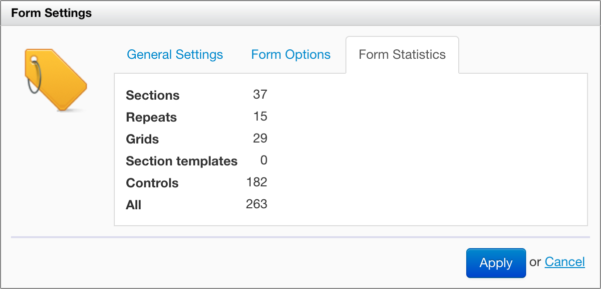

# Form Settings

<!-- toc -->

## Introduction

Some settings apply to the entire form definition. You access these settings with the "Form Settings" wrench icon on the top right of Form Builder. The General Settings also show initially when creating a new form definition.

## General Settings

General settings allow you to set:

- the Application Name
- the Form Name
- the form title in the current language
- the form description in the current language

## Form Options

[SINCE Orbeon Forms 2016.2]

Form options include options which apply to the entire form definition.

- [Singleton Form](../form-runner/advanced/singleton-form.md) 
- [Wizard View](../form-runner/feature/wizard-view.md)
- Maximum Attachment Size per Control
    - [SINCE Orbeon Forms 2017.1]
    - Use Default: use the [`oxf.fr.detail.attachment.max-size` property](../configuration/properties/form-runner-attachments.md#maximum-attachment-size)
- Maximum Aggregate Attachment Size
    - [SINCE Orbeon Forms 2017.1]
    - Use Default: use the [`oxf.fr.detail.attachment.max-size-aggregate` property](../configuration/properties/form-runner-attachments.md#maximum-aggregate-attachment-size)
    - Other: the maximum size allowed in bytes
- Allowed File Types
    - [SINCE Orbeon Forms 2017.1]
    - Use Default: use the [`oxf.fr.detail.attachment.mediatypes` property](../configuration/properties/form-runner-attachments.md#allowed-file-types)
    - Other: the maximum size allowed in bytes
- Appearance of Control Labels
    - Use Default: use the [`oxf.xforms.label.appearance` property](../xforms/controls/input.md#per-form-properties)
    - Inline: labels show inline above the control
    - Other: a space-separated list of mediatypes or wildcard mediatypes
- Use Placeholder for Text Fields and Text Areas
    - Labels show inline above the control for most fields.
    - For text, date, and time input fields, labels show as an HTML *placeholder* within the field when the field is empty.
    - For text areas, labels show as an HTML *placeholder* within the field when the field is empty. [SINCE Orbeon Forms 2017.1]
- Appearance of Control Hints
    - Use Default: use the `oxf.xforms.hint.appearance` property
    - Inline: hints show inline below the control
    - Tooltips: hints show as tooltips upon mouseover
- Use Placeholder for Text Fields and Text Areas
    - Hints show inline or as tooltips upon mouseover.
    - For text, date, and time input fields, hints show as an HTML *placeholder* within the field when the field is empty.
    - For text areas, hints show as an HTML *placeholder* within the field when the field is empty. [SINCE Orbeon Forms 2017.1]

Here is how hints appear depending on the type of control they are associated with:

## Form Statistics

Form statistics show various counts of form elements.

## See also

- Blog post: [Improved constraints on attachments uploads](http://blog.orbeon.com/2017/04/improved-constraints-on-attachments.html)
