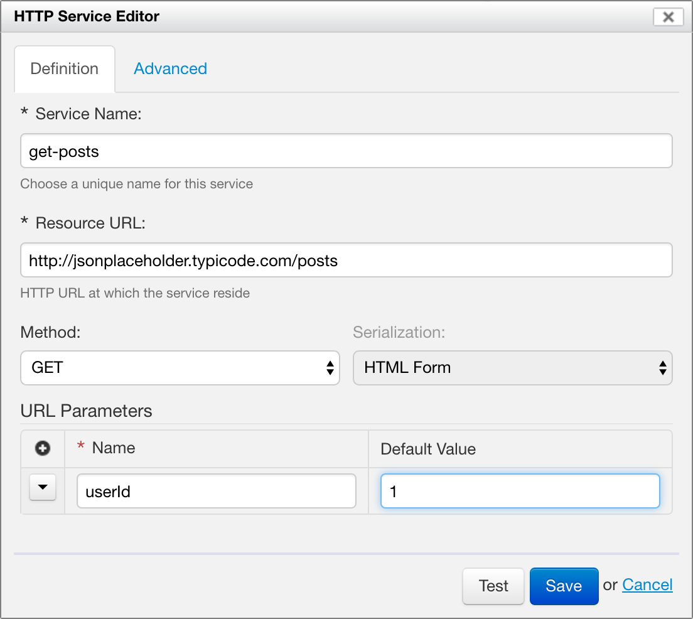
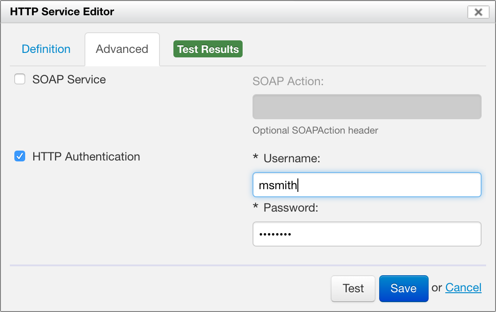
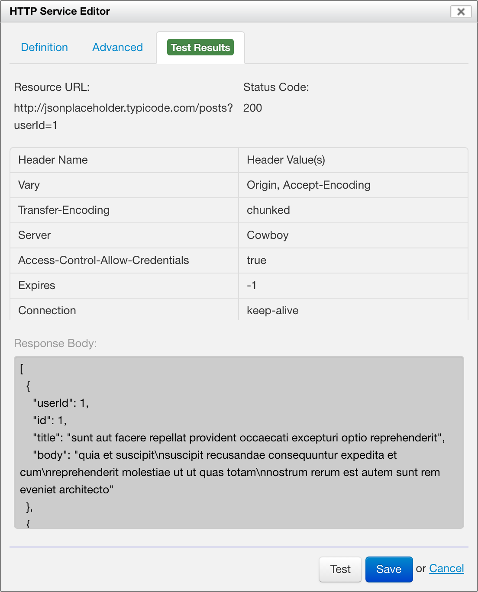

# HTTP services

<!-- toc -->

## Introduction

The HTTP Service Editor allows you to create simple REST services. The idea is that a form can call a service, typically passing XML back and forth.

To create a new HTTP service, click the Add icon under "HTTP Services". The HTTP Service Editor opens.

## Service definition

The "Definition" tab allows you to set the basic service parameters:

- **Service Name**
    - This is the name of the service, as seen by Form Builder. Must start with a letter, and may not contain spaces.
- **Resource URL**
    - `HTTP` or `HTTPS` URL to which the service must be called.
- **Method**
    - The HTTP method to use: `GET`, `POST`, `PUT` or `DELETE`.
- **Serialization**
    - This applies to the `POST` and `PUT` methods.
    - **XML:** Sends the request body as XML (`application/xml`)
    - **HTML Form:** Sends the request body as HTML form data (`application/x-www-form-urlencoded`)
- **Request Body**
    - This applies to the `POST` and `PUT` methods.
    - The XML document to send to the service.
- **URL Parameters**
    - SINCE Orbeon Forms 4.11
    - This applies to the `GET` and `DELETE` methods.
    - You can add as many URL parameters as needed.
    - A non-blank URL parameter specifies a default value for the parameter.
    - An action can set the value of a parameter.

*NOTE: Prior to Orbeon Forms 4.11, a "request body" is mandatory for the `GET` and `DELETE` methods. The body is not sent to the service, but instead is used to configure request parameters. Orbeon Forms 4.11 instead provides a specific user interface to set URL parameters. For example:*

```xml
<params>
    <userId>1</userId>
</params>
```

The following screenshot shows an example of filled-out service:



## Advanced parameters

The "Advanced" tab allows you to set advanced service parameters:

- **SOAP Service**
    - Whether this is a SOAP service
- **SOAP Action**
    - If selected, the value of the `SOAPAction` header.
- **HTTP Authentication**
    - Whether to use HTTP authentication.
    - **Username:** Username to use.
    - **Password:** Password to use.



## Testing a service

The Test button allows you to test the service. Before doing this, you have to set data in the request body for a `POST` or `PUT` request, or you might want to set URL parmeters for a `GET` or `DELETE`. Form Builder executes the service, and then provides information about the response returned, including:

- Whether an error occurred (green or red highlight)
- URL called
- Response status code
- Response headers
- Response body

This helps you troubleshoot the service call.



## Saving the service

Once your service is defined, the "Save" buttons saves it to the form. You can come back to it and modify it later by clicking on the Edit icon next to the service name. You can also delete the service using the trashcan icon.
