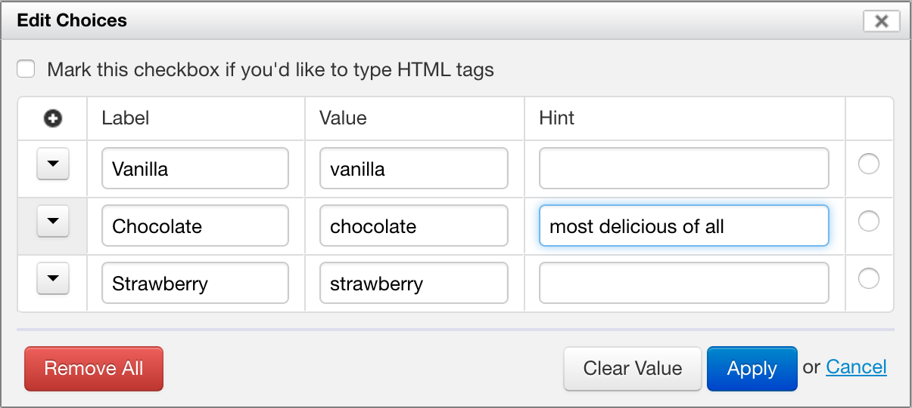
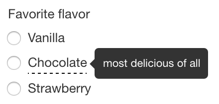

# Itemset editor

<!-- toc -->

## Introduction

You can edit the possible choices for selection controls by clicking on the icon that shows to the right of a control. When doing so, a dialog, like the one shown in the following screenshot, will appear.

For each choice, you can enter:

- A _label_ – This is what users see when they fill out the form.
- A _value_ – This is what is stored as part of the data when users select this choice.
- A _hint_ – The third column only shows for radio buttons and checkboxes. If you provide a hint for a choice, that choice will be highlighted and the hint you provided will show when users move the mouse pointer over the label, as shown in the following screenshot.

If you check the HTML checkbox, all the hints and labels you type in dialog are interpreted as HTML, allowing you to use HTML tags in label and hints, say to make text bold or italic.

At first, there are sample items available for the control. You add items using the "+" button, and remove them using the menu.

## Usability notes

- When in a label field, pressing the "tab" key into an empty value field automatically creates a default value. For example:
    - "Apple" becomes "apple"
    - "Wax Apple" becomes "wax-apple"
- When in a value field, pressing the "enter" key automatically adds a new item after the current item.

## Constraints

A value has constraints:

- For single selection controls (e.g. radio buttons), the value can be any string of characters.
- For multiple selection controls (e.g. checkboxes), the value must not contain spaces.

Item values are not localizable: they remain the same for each language. On the other hand, item labels can be localized. For example:

- English
    - Name: "Apple"
    - Value: "apple"
- French
    - Name: "Pomme"
    - Value: apple

This ensures that the data captured is machine-readable even if the user interface language changes.

## See also

- [Hints for checkboxes and radio buttons](http://blog.orbeon.com/2014/02/hints-for-checkboxes-and-radio-buttons.html) blog post
