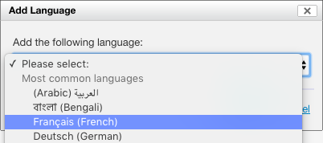
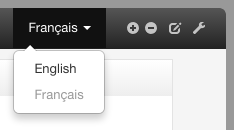

# Form Localization

<!-- toc -->

## Availability

This is an [Orbeon Forms PE](https://www.orbeon.com/download) feature.

## Localizing your forms

Form Builder has localization support. This means that your form's titles, labels, help messages, etc. can be specified in multiple languages. At runtime, the form user is presented with a default language and can switch the most appropriate language.

By default, only one language is present, typically English. The default language is configurable by the Form Builder system administrator. By pressing the "+" icon, a dropdown dialog shows. The dropdown list allows you to pick a new language to add to the list of languages of the form.

When a new language is added:

- It appears in the list of languages at the top right corner of the WYSIWYG area
- All the resources of the previously selected language are copied into the new language

You switch between languages by clicking on the language selector.  All localizable resources edits impact the currently selected language.

You can remove the currently selected language by pressing the "-" icon. This will remove all the resources associated with that language, so you must be careful before proceeding. A warning dialog will appear before the deletion is completed.

Here is how you typically proceed to create a form in two languages:

- Create the form in the primary language and add all localizable resources such as labels, help messages, hints, etc.
- Add the secondary language.
- Translate all localizable resources now visible on the form.
- When testing the form, you can switch between the two languages to make sure no resource was missed.

## See also

- [Localization](../form-runner/feature/localization.md)
- [Localizing Orbeon Forms](../contributors/localizing-orbeon-forms.md)
