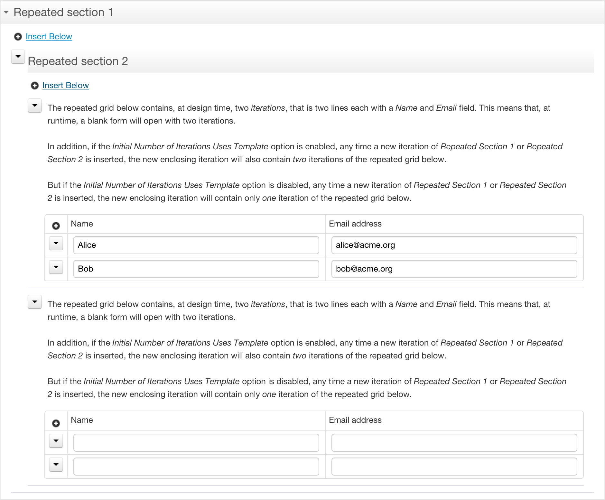
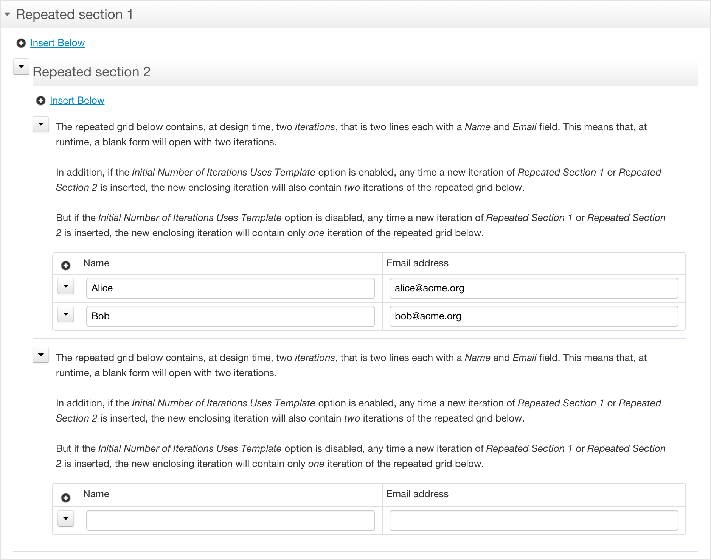

# Repeated grids

<!-- toc -->

## Introduction

Form Builder supports grids with repeated rows. You can repeat a single row (which is the most common case), or multiple heterogeneous (that is with different controls) rows.

## Creating a repeated grid

You insert a new repeated grid with the "New Repeated Grid" toolbox button.

Once the grid is inserted, you can add and remove (using the grid arrow and trash icons which appear on mouseover) columns and rows, and add controls to grid cells as you would in a regular non-repeated grid.

With only one row, the control labels are used as column headers and are not repeated within the grid. If present, control hints are also added to the column headers. That single row is repeatable with the "plus" icon.

You can add multiple heterogeneous rows with the arrow icons. In this case the entire group of rows is repeatable. Control labels and hints do not appear in column headers, but appear alongside the controls in the grid.

Whether there is a single or multiple repeatable rows, you can add and remove repetitions (iterations) of those rows with the "plus" icon. You typically let the user add iterations at runtime, but it is possible to create iterations in advance at design time as well.

## How things look at runtime

At runtime, notice how in the first grid a single row is repeated, and in the second grid the two rows are repeated.

In review mode and PDF mode, icons and menus disappear and the grid appears entirely readonly.

## Grid settings

Once a grid is inserted, you can edit its properties with the "Grid Settings" icon.

### Formulas

The "Visibility" and "Read-Only" formulas control whether the entire grid (including it's headers if any) is visible at all or whether its content is entirely readonly. 

*NOTE: Since Orbeon Forms 4.8, these settings properly apply to the entire grid. Previously, the grid's repeat headers did not hide properly for example when the grid was hidden. See issue [#635](https://github.com/orbeon/orbeon-forms/issues/635).*

### Repeat settings

The repeat settings control whether to use a custom iteration name (not recommended in most cases), and the minimum/maximum number of repeat iterations allowed.

[SINCE Orbeon Forms 4.11]

The "Apply Initial Value Formulas when Adding Iterations" option specifies whether the "Initial Value" formulas for controls within the grid are evaluated for new iterations.

With Orbeon Forms 4.11, the option is enabled by default for new forms and new repeated grids. The option is disabled by default for grids created with previous versions of Orbeon Forms.

With the option enabled, new iterations can have dynamic initial values:

[SINCE Orbeon Forms 4.11]

The "Initial Number of Iterations Uses Template" option specifies, when an *enclosing repeated section* creates a new iteration, how many iterations this repeated grid will contains:

- when enabled: the number of iterations shown in Form Builder (which can be no iterations at all, one iteration, two iterations, etc.)
- when disabled: exactly one iteration

The following screenshot shows a case with a repeated grid within nested repeated sections. At first, when the form shows, there are two iterations of the repeated grid.

With the option enabled on the grid, adding a new iteration of _Repeated section2_ causes the new iteration to contain a new repeated grid with two iterations:

While, with the option disabled on the grid, adding a new iteration of _Repeated section2_ causes the new iteration to contain a new repeated grid a single iterations:

<!--

Example:

-->

## See also

- Support for repeats lands in Form Builder: [older blog post](http://blog.orbeon.com/2012/04/support-for-repeats-lands-in-form.html)
- Inserting and reordering grid rows: [blog post](http://blog.orbeon.com/2013/11/inserting-and-reordering-grid-rows.html)
- Repeated sections: [blog post](http://blog.orbeon.com/2014/01/repeated-sections.html)
