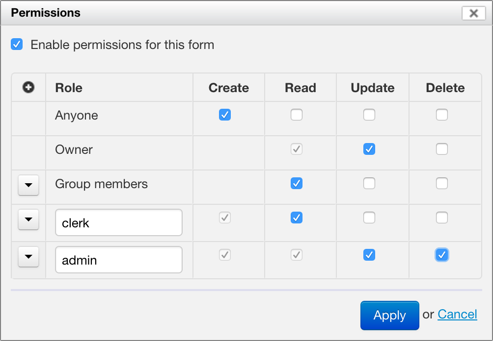

# Owner and group member permissions

<!-- toc -->

## Availability

See [Database Support](../../form-runner/persistence/db-support.md).

## Usage

Owner-based and group-based permissions are useful when you want users to only see their own data, or maybe also the data of other users in the same group. For Orbeon Forms to be able to show a user only her data, Orbeon Forms needs to know who that user is, and hence this can only be used for authenticated users.

To use this feature for a form, in Form Builder, when editing a form, open the *Permissions* dialog, and check boxes on the *Owner* and *Group member* lines as appropriate for your situation.



## Configuration

### Since Orbeon Forms 4.9

There is no particular configuration.

### With Orbeon Forms 4.8.x (eXist database only)

When using this features with eXist, you need to set the following property:

```xml
<property 
    as="xs:string"
    name="oxf.xforms.forward-submission-headers"
    value="Orbeon-Username Orbeon-Roles Orbeon-Group"/>
```

### With Orbeon Forms 4.3

With Orbeon Forms 4.3, owner/group-based permissions were not enabled by default, and you must set the following 2 properties to enable them:

```xml
<property as="xs:boolean" name="oxf.fr.support-owner-group" value="true"/>
<property as="xs:boolean" name="oxf.fr.support-autosave"    value="true"/>
```

## See also

- [Owner/group-based permissions AKA "See your own data"](http://blog.orbeon.com/2013/09/ownergroup-based-permissions-aka-see.html) blog post
- [Access control for deployed forms](deployed-forms.md)