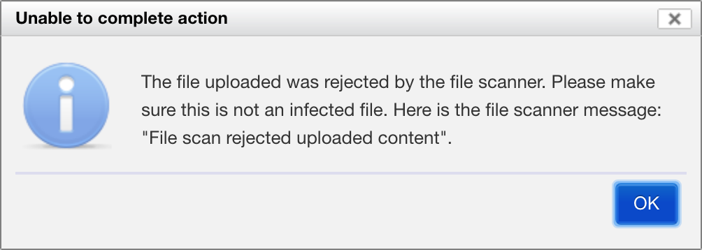

# File scan API

<!-- toc -->

## Availability

[SINCE Orbeon Forms 2017.2]

This is an Orbeon Forms PE feature.

## Rationale

When a user uploads files via one of the Form Runner attachment controls, a virus scanner can verify the file before it gets attached to the current form.

Orbeon Forms provides a simple Java API which allows integrating with virus scanning solutions.

## API

Orbeon Forms provide the following `FileScanProvider` abstract class as a base for concrete providers:

```java
package org.orbeon.oxf.xforms.upload.api.java;

public abstract class FileScanProvider {

    public void init();
    public void destroy();

    public FileScan startStream(String fileName, Map<String, String[]> headers);
}
```

When Orbeon Forms initializes the provider, it:

- creates an instance of the class
- calls the `init()` method

When Orbeon Forms is starting to receive an upload file, it calls the `startStream()` method. The method receives a
file name as provided by the web browser (which means that it must not be trusted), and HTTP header name/values as they
are received by Orbeon Forms. 

The provider implementation must return an implementation of a `FileScan`.

The `FileScan` interface is as follows :

```java
package org.orbeon.oxf.xforms.upload.api.java;

interface FileScan {
    public FileScanStatus bytesReceived(byte[] bytes, int offset, int length);
    public FileScanStatus complete(File file);
    public void abort();
}
```

As bytes are received, the `bytesReceived()` method is called. A provider may or may not make use of this method. If it
is unused, the provider must return an `ACCEPT` `FileScanStatus` (see below). This method allows incremental scanning
of a file.

When the file is completely uploaded and stored into a temporary file, but not yet attached to the user's form, the
`complete()` method is called with a pointer to the temporary file. The scanner can use this method to perform the
entirety of the scan in case `bytesReceived()` is not used.

Upon processing the `complete()` method, resources associated with the file scan must be cleared by the provider, whether
`REJECT` or `ERROR` is returned, or if any exception is thrown as part of the processing of `complete()`.

Both `bytesReceived()` and `complete()` must return a value from the `FileScanStatus` enumeration:  


```java
package org.orbeon.oxf.xforms.upload.api.java;

public enum FileScanStatus { ACCEPT, REJECT, ERROR }
```

- `ACCEPT`: accept the uploaded content
- `REJECT`: reject the uploaded content (for example because it is suspected to contain a virus)
- `ERROR`: any other error happened

If `REJECT` or `ERROR` is returned, or if any exception is thrown as part of `startStream()`, `bytesReceived()`, or
`complete()`, the uploaded file is rejected and an error is shown to the user.



If the user cancels the upload, or if any other error occurs on the Orbeon Forms side, the `abort()` method is called.
In this case, the file scan for the given file must be stopped and associated resources must be cleared, if any.

The `abort()` method may be called after the `complete()` method. 

## Registering a provider

The file scanning API uses the standard Java [`ServiceLoader`](https://docs.oracle.com/javase/8/docs/api/java/util/ServiceLoader.html)
API with a provider name of `org.orbeon.oxf.xforms.upload.api.FileScanProvider`.

The provider must:

- be a public class
- have a public no-arguments constructor

## Example

[`AcmeFileScanProvider`](https://github.com/orbeon/orbeon-forms/blob/master/file-scan-example/src/main/java/acme/filescan/AcmeFileScanProvider.java)
is a Java example of a provider which does nothing but:

- log method calls
- reject files which contain in their name the string "virus"

*NOTE: This obviously is not the right way to determine whether a file contains a virus or not.*

The service provider is described with this [`META-INF/services/org.orbeon.oxf.xforms.upload.api.FileScanProvider`](https://github.com/orbeon/orbeon-forms/blob/master/file-scan-example/src/main/resources/META-INF/services/org.orbeon.oxf.xforms.upload.api.FileScanProvider) file. 

The example project is provided [here](https://github.com/orbeon/orbeon-forms/tree/master/file-scan-example).