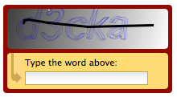

# Captcha Component

<!-- toc -->

## Which captcha is right for you

[reCAPTCHA][1] is almost a de facto standard on the web: more than a million reCAPTCHA are solved every day, it is used by a large number of mainstream sites, like Facebook, and is constantly updated providing a high level of security. Since 2009, this service is owned by Google.

Because of the high level of safety provided by reCAPTCHA, we recommend you use it, unless doing so isn't possible in your situation. Maybe, for instance, you don't want the server on which Orbeon Forms runs to connect to any external service, which the reCAPTCHA component does to verify the answer provided. If you can't use the reCAPTCHA, Orbeon Forms provides an alternate component, SimpleCaptcha, which runs entirely within Orbeon Forms, without the need to connect to any external server.

## Events

Both the `fr:recaptcha` and `fr:simple-captcha` components support the same events:

1. **Verifying the answer entered by users** — Both components don't include a _Verify_ button that triggers the value entered by users to be checked. This is to give more control to you, the form author, as to when the verification is done. For instance, you might want to verify the captcha when users click on a _Save_ button on your form. To trigger the value to be verified, dispatch a `fr-verify` event to the captcha.
2. **Verification succeeded** — When the verification succeeds, the component dispatches a `fr-verify-done` event. The example below, using the reCAPTCHA, listens to that event to run a submission.
3. **Verification failed** — When the verification fails, you get the `fr-verify-error` event. The example below, using the reCAPTCHA, listens to that event to show a case id `failure-case` (which might tell users the verification failed).
4. **Loading another captcha** — Specifically for the reCAPTCHA, as part of the context information for the fr-verify-error event, you get an error code, which you can access with `event('fr-error-code')`. This is the error code returned by the reCAPTCHA API, which is a string. Its value can either be:
    * `empty` — this tells you users didn't provide any answer. When that happens, you could notify users and keep the same challenge.
    * One of the values listed in the [reCAPTCHA API documentation][2] (look for the table under _Error Code Reference_). When this happens, you could notify users, and _need_ to change the challenge by dispatching `fr-reload` to the reCAPTCHA. (For added safety, the reCAPTCHA won't let users try to solve the same captcha multiple times.)

    ```xml
    <fr:recaptcha id="my-captcha">
        <xf:send ev:event="fr-verify-done" submission="save-submission"/>
        <xf:action ev:event="fr-verify-error">
            <xf:toggle case="failure-case"/>
            <xf:dispatch target="my-captcha" name="fr-reload"/>
        </xf:action>
    </fr:recaptcha>
    ```

## reCAPTCHA

### Usage

You can use this component to show users a captcha, like the one shown in the following screen shot:


1. First, you need to [sign up with reCAPTCHA][4] to get your own public/private key pair.
2. Store your public and private keys in an instance:

    ```xml
    <xf:instance id="config">
        <config>
            <public-key>6Lesx...</public-key>
            <private-key>6Lesx...</private-key>
        </config>
    </xf:instance>
    ```

    If you are using a captcha in multiple forms, you might want to store your public and private key in a separate "config" file which you include into your form.

3. Add the reCAPTCHA component to your form:

    ```xml
    <fr:recaptcha id="my-recaptcha">
        <fr:public-key ref="instance('config')/public-key"/>
        <fr:private-key ref="instance('config')/private-key"/>
        <!-- Event handlers for fr-verify-done and fr-verify-error; see section above -->
    </fr:recaptcha>
    ```

4. Add a way for users to trigger the verification of the text typed. For more on events, see the section above.

    ```xml
    <xf:trigger>
        <xf:label>Verify</xf:label>
        <xf:dispatch ev:event="DOMActivate" target="recaptcha" name="fr-verify"/>
    </xf:trigger>
    ```

### Configuration

You can configure:

* The theme, with the `theme` property.
* The language, with the `lang` property.

See the [reCAPTCHA documentation][5], under _Look &amp; Feel Customizations_ for more information on the possible values for the `theme` and `lang` properties. Just as with other properties, you can provide a static value using attributes:

```xml
<fr:recaptcha theme="white" lang="fr">
```

Or you can use nested elements if the values come from an instance:

```xml
<fr:recaptcha id="recaptcha">
    <fr:theme ref="instance('config')/theme"/>
    <fr:lang ref="instance('config')/lang"/>
</fr:recaptcha>
```

### SimpleCaptcha

You can use this component to show users a captcha, like the one shown in the following screen shot:



To use this component, where you want the captcha to show in your form, add:

```xml
<fr:simple-captcha id="my-simple-captcha">
```

Most likely, you'll want to add code dispatching an `fr-verify` event to your component to trigger a verification, and listeners on the `fr-verify-done` and `fr-verify-error` events. For more information on this, see the section _Events_ above.

## See also

- [Stop spammers by adding a CAPTCHA to your forms](http://blog.orbeon.com/2011/12/stop-spammer-by-adding-captcha-to-your.html)

[1]: http://en.wikipedia.org/wiki/ReCAPTCHA
[2]: https://developers.google.com/recaptcha/docs/verify?csw=1
[4]: https://www.google.com/recaptcha/admin#list
[5]: https://developers.google.com/recaptcha/old/docs/customization
