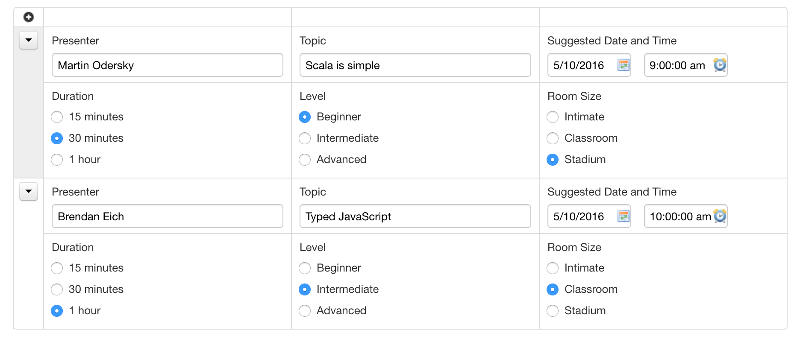
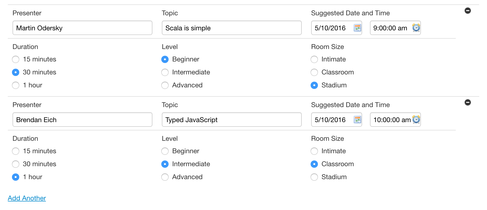

# Grid Component

<!-- toc -->

## What it does

The `fr:grid` component organizes contained controls in a grid of rows and columns. Features:

- configurable number of rows and columns
- optional repetition of its content
  - configurable min/max number of iterations
  - can repeat over several heterogeneous rows
  - built-in icons and menus to add, remove, and move repeated rows
  - supports `relevant` and `readonly` MIPs [SINCE Orbeon Forms 4.8]

## Appearance

### Full repeat appearance




### Minimal repeat appearance

[SINCE Orbeon Forms 2016.1]




## Basic usage

### Non-repeated mode

```xml
<fr:grid id="note-grid">
    <xh:tr>
        <xh:td>
            <xf:textarea id="note-text-control" bind="note-text-bind">
                <xf:label ref="$form-resources/note-text/label"/>
                <xf:hint ref="$form-resources/note-text/hint"/>
                <xf:help ref="$form-resources/note-text/help"/>
                <xf:alert ref="$form-resources/note-text/alert"/>
            </xf:textarea>
        </xh:td>
    </xh:tr>
</fr:grid>
```

Attributes:

- `id`: optional grid id. Form Builder always places an id.
- `repeat`: can be optionally set to `false`

_NOTE: In the future `bind` and `ref` should be supported._

### Repeated mode

```xml
<fr:grid
    id="note-grid"
    repeat="content"
    bind="note-bind"
    template="instance('note-template')"
    min="0">
    <xh:tr>
        <xh:td>
            <xf:textarea id="note-text-control" bind="note-text-bind">
                <xf:label ref="$form-resources/note-text/label"/>
                <xf:hint ref="$form-resources/note-text/hint"/>
                <xf:help ref="$form-resources/note-text/help"/>
                <xf:alert ref="$form-resources/note-text/alert"/>
            </xf:textarea>
        </xh:td>
    </xh:tr>
</fr:grid>
```

Attributes:

- `id`: optional grid id.
- `repeat`
  - `true`: legacy repeat mode
  - `content`: new repeat mode with an enclosing element [SINCE Orbeon Forms 4.8]
- `bind` or `ref`
  - with `repeat="content"`: single item binding which binds to the enclosing element
  - with `repeat="true"`: item sequence binding which binds to the repeated elements
- `template`
  - XML data template used to insert new data when iterations are inserted
  - optional when the grid is readonly
- `min` and `max`
  - minimum vs. maximum number of repeat iterations supported
  - can be an AVT
  - evaluation context
    - with `repeat="content"`: context of the binding (`bind` or `ref`)
    - with `repeat="true"`: context of the `fr:grid element`
  - are checked when the user attempts to add/remove iterations with the UI
- `remove-constraint`
  - optional XPath expression
  - evaluation context
    - context of the iteration item
  - if the constraint returns `false()`, the current row cannot be removed
- `freeze`
  - optional number of rows at the top which cannot be removed or moved
  - this cannot be an AVT
- `readonly`
  - force the grid to be readonly when set to `true`
  - this cannot be an AVT
- `apply-defaults` [SINCE Orbeon Forms 2016.1]
  - `true`: dynamic initial values (via the `xxf:default` MIP) apply to new iterations
  - missing or `false: dynamic initial values do not apply to new iterations
  - can be an AVT
  - see also: [Evaluation of initial values upon insert](../../xforms/actions/repeat-insert-delete.md#evaluation-of-initial-values-upon-insert)
- `appearance` [SINCE Orbeon Forms 2016.1]
  - `full`
    - the default appearance, as with Orbeon Forms 4.10 and earlier
    - row menu
      - reordering of rows
      - insertion of rows at specific points
      - removing of specific rows
  - `minimal`
    - does not show the "+" button at the top left
    - does not show the row menu and associated features
    - instead just provides "Add another" and "Remove" links at the bottom

## Data format

With `repeat="content"`:

- An enclosing element is present.
- Nested elements, typically suffixed with `-iteration`, enclose each repetition.

```xml
<note>
    <note-iteration>
        <note-text/>
    </note-iteration>
    <note-iteration>
        <note-text/>
    </note-iteration>
</note>
```

With legacy `repeat="true"`:

- No enclosing element is present.
- Elements are repeated at the top-level.

```xml
<note>
    <note-text/>
</note>
<note>
    <note-text/>
</note>
```

A template instance contains the XML data to insert for a new iteration:

```xml
<xf:instance id="note-template">
    <note-iteration xmlns="">
        <note-text/>
    </note-iteration>
</xf:instance>
```

## Relevance and readonly behavior

With `repeat="content"`:

- if the bound item is non-relevant, the grid is entirely hidden
- if the bound item is readonly, the grid is entirely readonly and menus and icons don't show

In either case, `fr:grid` contains the rows to repeat as `xh:tr`. Each `xh:tr` contains `xh:td` cells as needed.

## Events

[SINCE Orbeon Forms 2016.1]

The following events are dispatched to the `fr:grid` element:

| Event name | Description |
| --- | --- |
| `fr-iteration-added` | Dispatched when the user has just added an iteration |
| `fr-iteration-removed` | Dispatched when the user has just removed an iteration |

These events are not dispatched if the number of iterations changes by other means, for examle if the data is replaced, or inserts/deletes happen outside of the component.


## See also

- [Section component](section.md)
- [Form Builder: Repeated Grids ](../../form-builder/repeated-grids.md)
- Example of use outside of Form Runner: [gist](https://gist.github.com/orbeon/5d592bfa4640569b116f)
- [Evaluation of initial values upon insert](../../xforms/actions/repeat-insert-delete.md#evaluation-of-initial-values-upon-insert)
