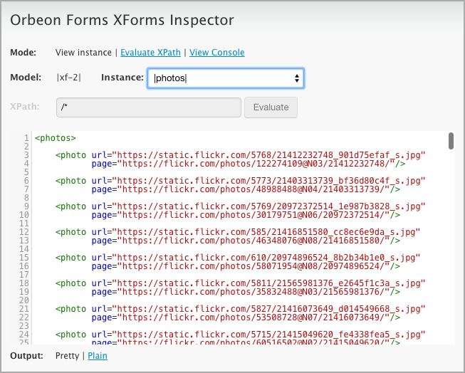

> [[Home]] ▸ Form Runner ▸ [[XBL Components|Form Runner ~ XBL Components]]

## Overview

The XForms Inspector allows you to:

1. See the "live" content of your instances as you interact with the form.
2. Type in XPath expression, and see what the result is when they are evaluated.
3. See what is logged by your form to the XForms inspector console (_experimental_).



## The console

### The fr-log event

The console is an experimental new feature, and is likely to be improved and changed in the future. When you select _View Console_ , the output area of the inspector shows what your XForms code logs to the console. You log something to the console by dispatching an event `fr-log` to the id of the XForms inspector. If you included the inspector by setting the `oxf.epilogue.xforms.inspector` property to `true`, that id is `orbeon-xforms-inspector`. Otherwise, it is the id you put on the `<fr:xforms-inspector>`. The event take one parameter:
`fr-messages`. Its value is a sequence of values, either elements or atomic values (strings, numbers…).

```xml
<xf:dispatch name="fr-log" target="orbeon-xforms-inspector">
    <xxf:context
        name="fr-messages"
        select="instance('fr-xforms-inspector-input')"/>
</xf:dispatch>
```

### Console input

In some cases, you'd like to evaluate an XPath expression you type in the console, but you want that XPath expression to be evaluated in a very particular context, for instance in a middle of a sequence of actions. For this, add the following instance to your form:

```xml
<xf:instance id="fr-xforms-inspector-input">
    <input/>
</xf:instance>
```

When the XForms inspector finds this instance, it shows an additional input field, and binds it to your `fr-xforms-inspector-input` instance. You can then use fr-log evaluating the expression you typed in the newly added input field with:

```xml
<xf:dispatch
    event="xforms-value-changed"
    name="fr-log"
    targetid="orbeon-xforms-inspector">
    <xxf:context
        name="fr-messages"
        select="saxon:evaluate(instance('fr-xforms-inspector-input'))"/>
</xf:dispatch>
```
