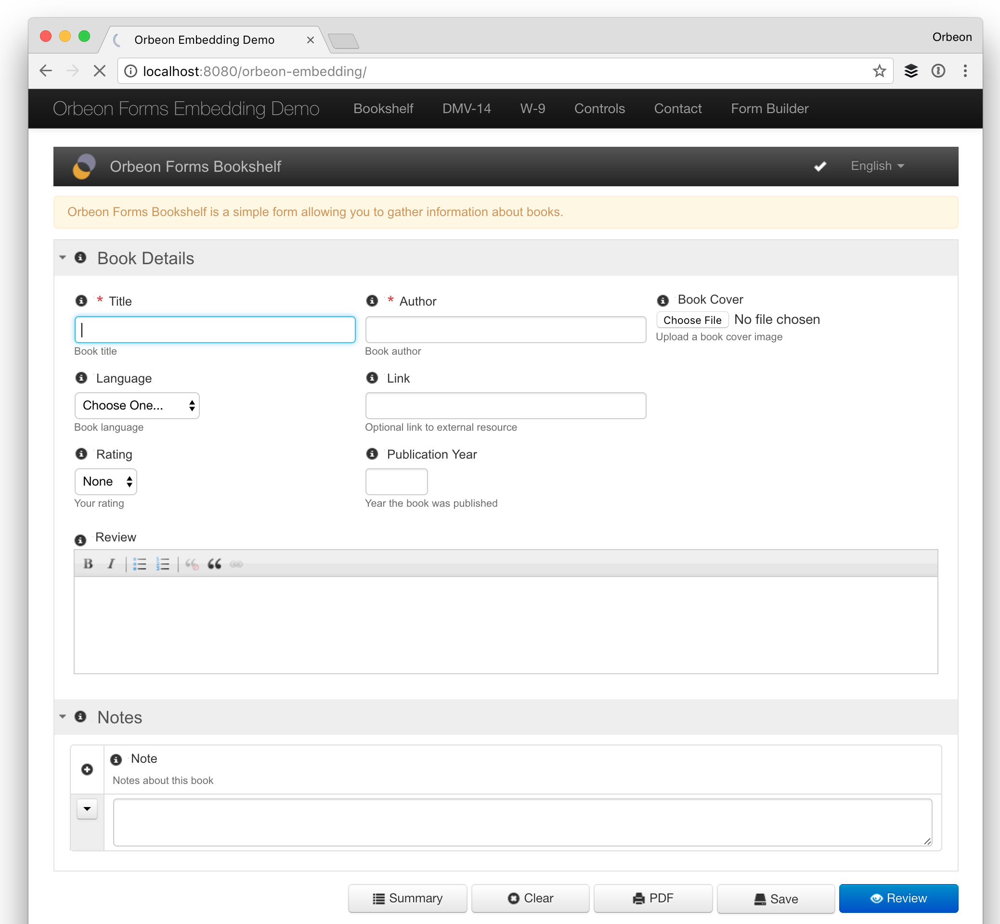
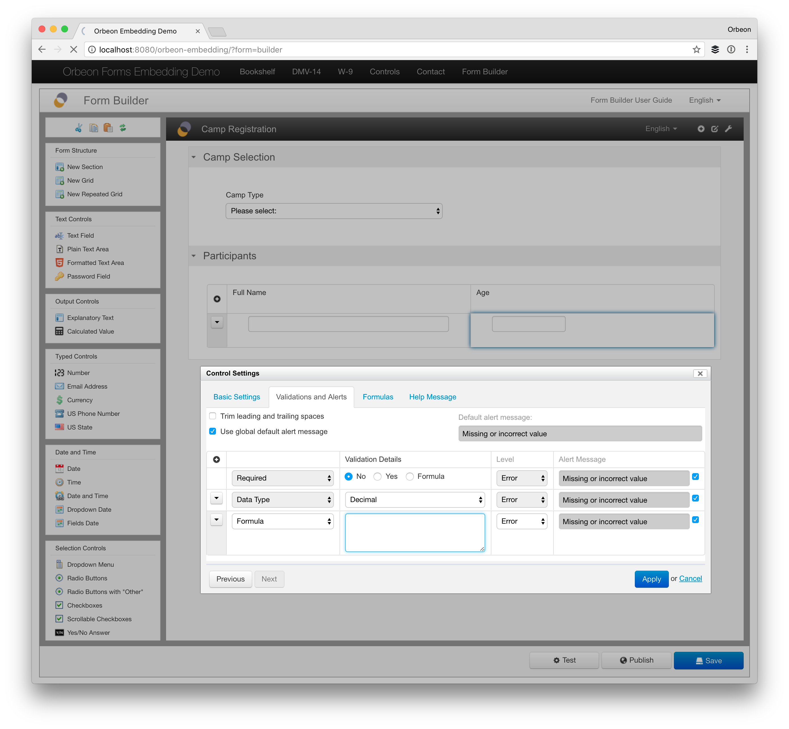

# Form Runner Java Embedding API


## Availability

Since Orbeon Forms 4.7.

## Rationale

The intent is to allow Java (and other Java Virtual Machine (JVM)-based languages) applications to easily embed forms produced with Form Builder within other pages.



## Configuration

### Basic configuration

#### Your web application

Your own web app does the following:

1. Include `orbeon-embedding.jar` and `slf4j-api-1.7.7.jar` under `WEB-INF/lib`. Both are included in `orbeon-embedding.war` which ships 
   with Orbeon Professional Edition (PE) only.  
2. Setup the filter in your `web.xml` per the snippet below.
3. Call the embedding API when producing a page, as done in the example below.


_IMPORTANT: Make sure that you application uses the UTF-8 character encoding for the HTML response._

This is a typical filter configuration:

```xml
<!-- Declare and configure the embedding filter -->
<filter>
    <filter-name>orbeon-form-runner-filter</filter-name>
    <filter-class>org.orbeon.oxf.fr.embedding.servlet.ServletFilter</filter-class>
    <init-param>
        <param-name>form-runner-url</param-name>
        <param-value>http://localhost:8080/orbeon</param-value>
    </init-param>
    <init-param>
        <param-name>orbeon-prefix</param-name>
        <param-value>/orbeon</param-value>
    </init-param>
</filter>
<!-- Any JSP resource is processed by the filter -->
<filter-mapping>
    <filter-name>orbeon-form-runner-filter</filter-name>
    <url-pattern>*.jsp</url-pattern>
    <dispatcher>REQUEST</dispatcher>
    <dispatcher>FORWARD</dispatcher>
</filter-mapping>
<!-- This ensures that Orbeon resources are proxied appropriately -->
<filter-mapping>
    <filter-name>orbeon-form-runner-filter</filter-name>
    <url-pattern>/orbeon/*</url-pattern>
    <dispatcher>REQUEST</dispatcher>
    <dispatcher>FORWARD</dispatcher>
</filter-mapping>
```

And here is an example of embedding a form from a JSP page:

```jsp
<%@ page
    pageEncoding="utf-8"
    contentType="text/html; charset=UTF-8"
    import="org.orbeon.oxf.fr.embedding.servlet.API" %>
<!DOCTYPE HTML>
<html>
<body>
    <%
        API.embedFormJava(
            request,            // HttpServletRequest: incoming HttpServletRequest
            out,                // Writer: where the embedded form is written
            "my_application",   // String: Form Runner app name
            "my_form",          // String: Form Runner form name
            "new",              // String: Form Runner action name
            null,               // String: Form Runner document id (optional)
            null,               // String: query string (optional)
            null                // Map<String, String>: custom HTTP headers (optional)
        );
    %>
</body>
</html>
```

The `Map<String, String>` allows passing a Java `Map` of HTTP header name/value pairs. These are passed to Form Runner when loading a form. Form Runner can access HTTP headers using the [`xxf:get-request-header()` XPath function](https://doc.orbeon.com/xforms/xpath/extension-http.html#xxfget-request-header).

#### Form Runner configuration

You deploy Form Runner in a separate web app, which can be located in the same servlet container as your web app or in a separate or even remote servlet container.

Form runner must use "combined resources" to work. This is the case by default in `prod` mode (see [Run Modes](../../configuration/advanced/run-modes.md)), but if you happen to have setup Orbeon Forms in `dev` mode, make sure to add this property in your `properties-local.xml`:

```xml
<property
    as="xs:boolean"
    name="oxf.xforms.combine-resources"
    value="true"/>
```

### Passing information about the current user

You can pass information about the current user to Orbeon Forms through headers. For this:

1. Enable header-based authentication by editing the `properties-local.xml` in your Orbeon Forms web app, adding:

    ```xml
    <property 
        as="xs:string"
        name="oxf.fr.authentication.method"
        value="header"/>
    ```

2. Back to your web app, pass the current user's username as the value of the `My-Username-Header` header, through a map you provide as the last argument to your call to `API.embedFormJava()`:

    ```java
    Map<String, String> headers = new HashMap<String, String>();
    headers.put("My-Username-Header", request.getRemoteUser());
    API.embedFormJava(…, headers);
    ```

If needed, you can also [pass the user's roles and group through additional headers](../access-control/users.md#if-using-individual-headers).

### Logging configuration

The embedding JAR uses SLF4J for logging. If your application already uses SLF4J and already has slf4j-api.jar, you can remove the one provided by Orbeon under `WEB-INF/lib`. Otherwise, you must keep slf4j-api.jar in your application's `WEB-INF/lib` folder.

*OPTIONAL: In addition, if you want to actually configure logging for the embedding library, you must add a logging adapter for SLF4j and the appropriate configuration file, for example for log4j. See the sample configuration file under `WEB-INF/classes/log4j.properties.template`.*

### HTTP client configuration

The embedding implementation communicates with the rest of Orbeon Forms via HTTP or HTTPS. In general, you probably won't have to change this configuration. By default, it is as follows:

```xml
<init-param>
    <param-name>oxf.http.stale-checking-enabled</param-name>
    <param-value>true</param-value>
</init-param>
<init-param>
    <param-name>oxf.http.so-timeout</param-name>
    <param-value>0</param-value>
</init-param>
<init-param>
    <param-name>oxf.http.chunk-requests</param-name>
    <param-value>false</param-value>
</init-param>
<init-param>
    <param-name>oxf.http.proxy.host</param-name>
    <param-value/>
</init-param>
<init-param>
    <param-name>oxf.http.proxy.port</param-name>
    <param-value/>
</init-param>
<init-param>
    <param-name>oxf.http.proxy.exclude</param-name>
    <param-value/>
</init-param>
<init-param>
    <param-name>oxf.http.ssl.hostname-verifier</param-name>
    <param-value>strict</param-value>
</init-param>
<init-param>
    <param-name>oxf.http.ssl.keystore.uri</param-name>
    <param-value/>
</init-param>
<init-param>
    <param-name>oxf.http.ssl.keystore.password</param-name>
    <param-value/>
</init-param>
<init-param>
    <param-name>oxf.http.proxy.use-ssl</param-name>
    <param-value>false</param-value>
</init-param>
<init-param>
    <param-name>oxf.http.proxy.username</param-name>
    <param-value/>
</init-param>
<init-param>
    <param-name>oxf.http.proxy.password</param-name>
    <param-value/>
</init-param>
<init-param>
    <param-name>oxf.http.proxy.ntlm.host</param-name>
    <param-value/>
</init-param>
<init-param>
    <param-name>oxf.http.proxy.ntlm.domain</param-name>
    <param-value/>
</init-param>
```

Details about the meaning of these parameters are [available here](../../configuration/properties/general.md).

### HTTP server configuration

You can enable HTTP gzip compression between the embedding implementation and Form Runner. For example, with Tomcat:

```xml
<Connector
    port="8080"
    protocol="HTTP/1.1"
    connectionTimeout="20000"
    compression="force"
    compressableMimeType="
        text/html,
        text/xml,
        text/plain,
        text/css,
        text/javascript,
        text/json,
        application/x-javascript,
        application/javascript,
        application/json"
    redirectPort="8443"/>
```
## Usage scenarios

In your Java web application, any page covered by the servlet filter can call the embedding API. You can have a single page calling a single form, or several pages each calling a different form. Or, pages can (based on URL parameters, internal application state, etc.), embed a form dynamically.

As of Orbeon Forms 4.7, the embedded form cannot navigate in place to another form or mode (such as Review).

However, it can save form or send form data as it does in the standalone case. It can also run custom [processes](../../form-runner/advanced/buttons-and-processes/README.md) which can redirect the entire embedding page with `navigate`, or run JavaScript functions with `navigate(uri = "javascript:alert('Done!')")`. This allows communicating with the embedding application.

## Form Builder embedding

[SINCE Orbeon Forms 2016.3]

In addition to published forms, you can embed Form Builder: just use `orbeon` and `builder` as Form Runner app/form names.
 
The embedding application can set the size the embedded Form Builder `<div>` element via CSS or JavaScript, and Form Builder will adjust its size accordingly:

```html
<div class="orbeon orbeon-portlet-div ...>
```

The Form Builder "New" and "Summary" buttons are hidden when Form Builder is embedded, as navigating between pages is not yet supported when embedding.



## How it works

The embedding implementation:

- makes an HTTP or HTTPs request to Form Runner to retrieve the HTML to embed when you call the API
- appropriately rewrites URLs in the HTML returned by Form Runner
- keeps track of session and other cookies
- proxies requests for resources, Ajax calls and file uploads to Form Runner

## Limitations

- navigation between pages, such as the Form Runner Edit and Review pages, is not supported
- the `send` action within a process does not support `replace="all"`
- embedding multiple forms is known to work in some cases, but has known issues so we don't recommend doing this (see [#1854](https://github.com/orbeon/orbeon-forms/issues/1854))
- `oxf.xforms.combine-resources` must be set to `true`

## See also 

- Blog post: [Form Builder embedding](http://blog.orbeon.com/2017/02/form-builder-embedding.html)
