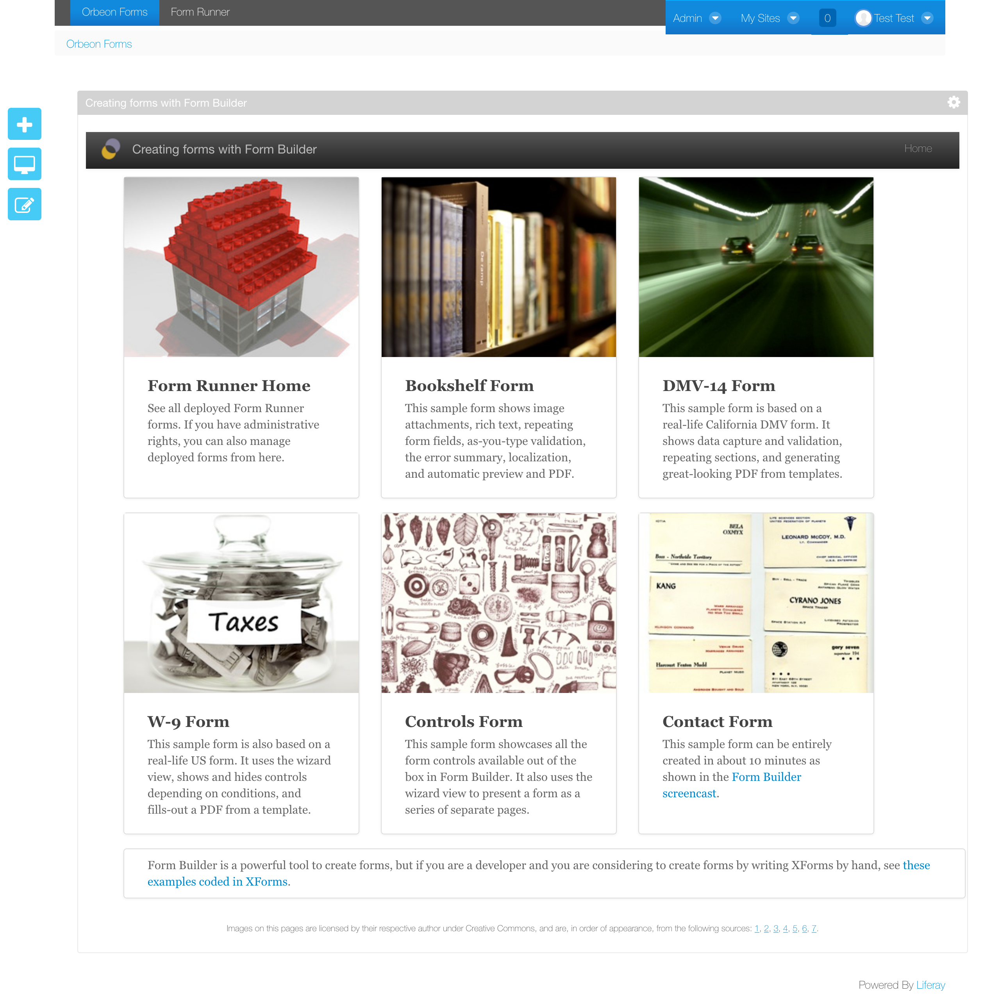

# Form Runner Liferay Full Portlet

<!-- toc -->

Please make sure to check the [[Form Runner Liferay Proxy Portlet Guide|Form-Runner-~-Portal-~-Liferay-Proxy-Portlet-Guide]]
as well, as that is the recommended way to deploy Orbeon Forms into Liferay, and [[Form Runner Embedding|Form-Runner-~-Embedding]]
for a comparison of portlet deployments.

## Availability

This is an Orbeon Forms PE feature, available since Orbeon Forms 4.0.

## Deploying into Liferay

### Configuration

The Orbeon Forms WAR can be directly deployed into the Liferay portal. By default, the Form Runner demo forms and XForms examples are immediately available within the portlet:



The following steps assume that:

* Liferay is deployed on port 8080
* the Orbeon Forms WAR is deployed under the name "orbeon" (which is the default if the WAR file is called orbeon.war)

Installation steps:

1. __Deploy orbeon.war:__ Start Liferay. When it is fully started move the `orbeon.war` into the Liferay deploy directory (e.g. `~/liferay/deploy`). At this point, you should see message indicating that Orbeon is being deployed. Monitor the Liferay output as well as the `logs/orbeon.log` for possible errors.


2. __Enable dynamic resource reloading (optional):__ Remove the file `webapps/orbeon/META-INF/context.xml` and restart Liferay. For more information on what this does, see note 2 below.


3. __Configuration for Form Runner (optional):__ You can skip this step if you do not intend to use Form Runner or Form Builder in a portlet. Otherwise, create a file `WEB-INF/resources/config/properties-local.xml` which declares the following properties (and other properties you might want to override):

    ```xml
    <properties xmlns:xs="http://www.w3.org/2001/XMLSchema"
                xmlns:oxf="http://www.orbeon.com/oxf/processors">

        <!-- Configure authentication properties through headers -->
        <property
            as="xs:string"
            name="oxf.fr.authentication.method"
            value="header"/>

        <!-- If you want the Liferay user email used for Form Runner authentication -->
        <property
            as="xs:string"
            name="oxf.fr.authentication.header.username"
            value="Orbeon-Liferay-User-Email"/>

        <!-- If you want Liferay roles used -->
        <property
            as="xs:string"
            name="oxf.fr.authentication.header.roles"
            value="Orbeon-Liferay-User-Roles"/>

    </properties>
    ```

    The host name (`localhost`), port (`8080`), and context path (`orbeon`) must be updated to match your local configuration.

4. __Add the Orbeon Forms portlet:__ Log into the portal, go to the Add menu and create a new page, for example _Orbeon Page_:

    

    Go to the Add menu again and select _More…_:

    

    Select the _Orbeon Forms Portlet_ entry:

    

    Drag the portlet to the page. The Orbeon Forms home page will show.

NOTE:

When Liferay deploys Orbeon Forms, it changes some of the descriptors and adds a `META-INF/context.xml` which is not
present in the distribution of Orbeon Forms. This file contains:

```xml
<context antijarlocking="true" antiresourcelocking="true">
```

which causes Tomcat to, on startup, make a copy of the Orbeon web application into its temp directory and use that
copy instead of the files under `webapps/orbeon`. That copy is removed when the server shuts down, and will be
done again the next time the server is started. This makes starting Liferay slower, but more importantly this means
that changes you make to files under `webapps/orbeon` after the server started will never be picked up. So any
modification to the resources (`WEB-INF/resources`) of your application will require a restart of Liferay.
This  can be quite very time consuming and annoying, hence our recommendation to remove the `META-INF/context.xml`
generated by Liferay.

### Accessing liferay users and roles

When running in Liferay, you can access some specific user and roles information from XForms.

Getting the current user's email:

```ruby
xxf:get-request-header('orbeon-liferay-user-email')
```

Example:

`'test@liferay.com'`

Getting the current user's full name:

```ruby
xxf:get-request-header('orbeon-liferay-user-full-name')
```

Example:

`'Joe Bloggs'`

Getting the current user's role names:

```ruby
xxf:get-request-header('orbeon-liferay-user-roles')
```

This returns a sequence of strings, with one string per role.

Example:

`('Administrator', 'Power user', 'User')`

Alternatively, you can use the standard Orbeon-Username and Orbeon-Roles headers. See also [[Access Control|Form-Runner-~-Access-Control]].

### Performance tuning

For large pages, we have found that the Liferay strip filter can take an extremely long time to process a response.
You can disable that filter in your `portal-ext.properties` with:

```
com.liferay.portal.servlet.filters.strip.StripFilter=false
```

## Creating a new landing page for the portlet

By default, the portlet shows a list of Orbeon Forms sample forms and apps.

To change this, you need to:

1. Modify `WEB-INF/resources/page-flow-portlet.xml.`
2. Create a new landing page in XHTML format.
3. Change the default Orbeon theme so that no custom Orbeon CSS is added.

A simple way do implement this is as follows:

First, replace this line in `page-flow-portlet.xml`:

```xml
<page id="home" path-info="/home/" model="apps/home/page-flow.xml">
```

with:

```xml
<page id="home" path-info="/home/" view="home.xhtml">
```

Second, create a new file, `WEB-INF/resources/home.xhtml`, with content such as:

```html
<html xmlns="http://www.w3.org/1999/xhtml">
    <head>
        <title>Form Runner Home</title>
    </head>
    <body>
        <a href="/fr/">Link to the Form Runner home page</a>
        <a href="/fr/acme/form1/summary">Link to summary page of form acme/form1</a>
        <a href="/fr/acme/form2/new">Link to new page of form acme/form2</a>
    </body>
</html>
```

This is the landing page itself, and it can contain any XHTML you like. Typically would include links to specific Form Runner paths as shown in the example above.

Finally, to change the Orbeon portlet theme to the plain theme, set this property:

```xml
<property
  as="xs:anyURI"
  name="oxf.epilogue.theme.embeddable"
  value="oxf:/config/theme-embeddable.xsl"/>
```
