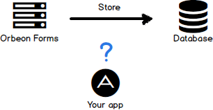
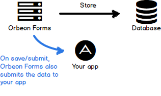
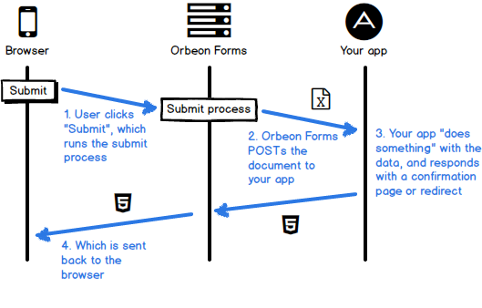
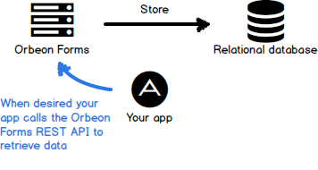
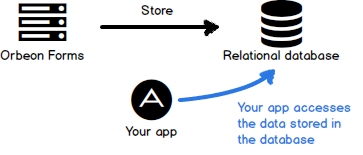
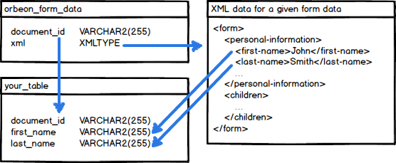

# Accessing Data

## Situation

You've created forms with Form Builder, published those forms, and setup Orbeon Forms so it [stores data captured by the forms in your relational database](../persistence/relational-db.md). Now, how can another app of yours access this data?

In what follows, you'll see  3 techniques for doing so:

1. Having Orbeon Forms send the data to your app when users click on the submit button in your form.
2. Your app calling a REST API provided by Orbeon Forms for this purpose.
3. Your app accessing the data directly in the database where it is saved by Orbeon Forms.

## Techniques

### 1. Send data on submit

In most cases, this is the best option, and the one we recommend. In essence, you setup Orbeon Forms so when users fill out a form and submit it, Orbeon Forms sends the data users entered to your app. Your app can do whatever it wants with this data, and if needed, in the response to Orbeon Forms, your app can tell Orbeon Forms which page the user should go to next.

Let's see in more details what this entails:

1. When users click the *submit* button on a form created in Form Builder (or for that matter any other button at the bottom of the form), a *process* runs. In essence, a *process* defines a sequence of actions to be performed, and one of them can be to *send* the data to your app. Currently, processes are defined in your [`properties-local.xml`](../../configuration/properties/README.md). To learn more about processes, see the documentation on [Buttons and Processes](../advanced/buttons-and-processes/README.md).
2. In your process, you'll be using the [`send()`](../advanced/buttons-and-processes/README.md#send) action to instruct Orbeon Forms to POST the data entered by users to a URL of your choice.
3. Your app can do what it wants with the data it receives: perform some operation in a database, call a service, etc.
4. If you passed the `replace = "all"` parameter to `send()`, then what your app sends back to Orbeon Forms in the HTTP response will be sent/proxied back to the browser by Orbeon Forms. This allows you to send a custom confirmation page, or issue a redirect to another page or form that users should go to next.

### 2. Call the REST API

Your second option is to have your app call the Orbeon Forms [persistence API](../api/persistence/README.md) to retrieve the data saved by Orbeon Forms in the database. This is a simple REST API, and you'll want to make a first call to the [search API](../api/persistence/search.md) to *list* data submitted or saved with a specific form, and then a call to the [CRUD API](../api/persistence/crud.md) to *retrieve* any piece of data you're interested in.

As mentioned, the API provided by Orbeon Forms is quite simple, but there are a few complications to keep in mind when calling such an API, which often make [option 1](#1-send-data-on-submit) above more desirable:

1. You're deciding when to call the API. Most likely you'll want to do this at a regular interval, like every hour or every day, to process any new data submitted to the system. This means that you need to have a cron-like infrastructure to perform that task on a regular basis, and that your app won't know about new data in real-time.
2. Assuming your app is just interested in processing new data, it will need to somehow keep track of what data it has already processed.
3. Out-of-the-box, for security reasons, access to the REST API is blocked. You can either completely open up access to the API at the Orbeon Forms level, and protect it through some other mean (e.g. filter), or setup some authentication between the caller of the API and Orbeon Forms, through an authorization service. You can find more about this in [Authorization of Pages and Services](../../xml-platform/controller/authorization-of-pages-and-services.md).

### 3. Accessing the database

Accessing data in the database rather than through an API, per [option 2](#2-call-the-rest-api) above, increases the chances that changes to your code will be needed when you upgrade Orbeon Forms, as the format of the Orbeon tables is more likely to change than the API. Despite this caveat, we've found that it is often more practical for customers to access data in a database rather than through an API.

The table you'll be the most interested in is `orbeon_form_data`, where the data users save or submit goes. In that table, a given "form data" (i.e. instance of a user filling out a form), is identified with a `document_id`. The actual data, i.e. values of the fields, is stored as XML in the `xml` column. For more details on the table format, see the DDL creating those tables for your database in the [Relational Database Setup](../persistence/relational-db.md), as it varies slightly depending on the database you're using.

One way to access the data in `orbeon_form_data` is through a database trigger that copies the data you're interested in from the XML in `orbeon_form_data` every time new data is saved; for instance see an [example of such a trigger for MySQL](../persistence/relational-db.md).

