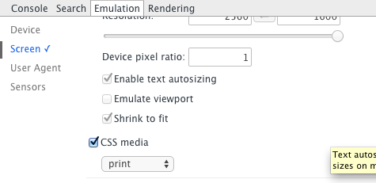

# Automatic PDF

<!-- toc -->

## Context

Form Runner has two modes of [PDF production](../../form-builder/pdf-production.md). When using the automatic mode, the PDF is produced from HTML and CSS. It is sometimes desirable to modify the appearance of the PDF produced. This typically involves modifying CSS.

## How to figure out what CSS is applied to the PDF?

The closest from the PDF is the Form Runner Review (or `view`) mode, not the `new` or `edit` mode. Compare
[this page](http://demo.orbeon.com/orbeon/fr/orbeon/bookshelf/view/891ce63e59c17348f6fda273afe28c2b) with the PDF version.
In both cases, the HTML markup is about the same, and you can use browser developer tools to inspect how CSS rules are applied.

Note that in particular, the `view` mode does not have `input` or other HTML form fields. Instead, you can
target nested `.xforms-field` elements.

With Chrome, in particular, you can also put the browser in `@media print` emulation:

With that setting enabled, the main remaining difference between the Review page and the PDF is how browsers and the PDF
library Orbeon Forms uses (FlyingSaucer) interpret CSS, as there are differences. Often you have to go by trial and error.
