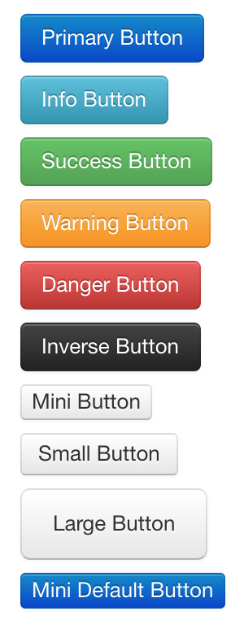

# Button control


## Introduction

In XForms, buttons are called "triggers" and use the `<xf:trigger>` element. A special button directly tied to a submission is called "submit" and uses the `<xf:submit>` element.

## Full appearance

### Description

This is the default appearance of a button.


### Usage

```xml
<xf:trigger>
  <xf:label>My Button</xf:label>
</xf:trigger>
```

```xml
<xf:submit submission="my-submission">
  <xf:label>Submit</xf:label>
</xf:submit>
```

or:

```xml
<xf:trigger appearance="full">
  <xf:label>My Button</xf:label>
</xf:trigger>
```

```xml
<xf:submit submission="my-submission" appearance="full">
  <xf:label>Submit</xf:label>
</xf:submit>
```

## Minimal appearance

### Description

The `minimal` appearance creates a button which appears like a link.


### Usage

```xml
<xf:trigger appearance="minimal">
  <xf:label>My Link Button</xf:label>
</xf:trigger>
```

## Other appearances

When the trigger has the `full` appearance, the following additional appearances are supported:

- `xxf:primary`
- `xxf:info`
- `xxf:success`
- `xxf:warning`
- `xxf:danger`
- `xxf:inverse`
- `xxf:mini` (SINCE Orbeon Forms 2016.3)
- `xxf:small` (SINCE Orbeon Forms 2016.3)
- `xxf:large` (SINCE Orbeon Forms 2016.3)
<!--- `xxf:block` (SINCE Orbeon Forms 2016.3) -->



These appearances are mutually exclusive. They match corresponding [Twitter Bootstrap button classes](http://getbootstrap.com/2.3.2/base-css.html#buttons). 

Example:

```xml
<xf:trigger appearance="xxf:primary xxf:mini">
  <xf:label>My Button</xf:label>
</xf:trigger>
```

## Creating a button with embedded images and markup

[TODO]

## Modal trigger and submit

Usually, activating a trigger or submit button on the client doesn't prevent further actions in the user interface. Sometimes however it is useful to block such actions until further processing is complete, for example calling a submission that saves a document.


You can obtain this behavior by using the `xxf:modal="true"` attribute on `<xf:trigger>` and `<xf:submit>`:

```xml
<xf:trigger xxf:modal="true">
    <xf:label>Save</xf:label>
    <xf:send ev:event="DOMActivate" submission="save-submission"/>
</xf:trigger>
```

With this attribute set to true, user input is blocked until all the events triggered by `DOMActivate` are processed. In the meanwhile, the page is grayed out and an icon appears indicating that background processing is taking place.

As soon as users activate (press enter or click) on a modal trigger or submit, the corresponding button loses the focus. This prevents users from being able to press enter and thus activate a button which still has the focus, while screen is grayed out.

