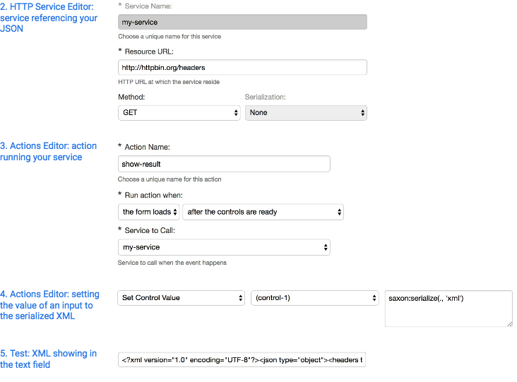

# JSON support

<!-- toc -->

[SINCE Orbeon Forms 2016.1]

## Receiving JSON

### Introduction

When an `xf:submission` or by an `xf:instance` with a `src` or `resource` attribute receives content with the `application/json` mediatype, Orbeon Forms parses the received JSON and converts it to an XML representation friendly to XPath expressions.

[SINCE Orbeon Forms 2017.1] In addition to the `application/json` mediatype, mediatypes of the form `a/b+json` are recognized.

### Conversion examples

The following JSON object:

```json
{ "given": "Mark", "family": "Smith" }
```

converts to:

```xml
<json type="object">
    <given>Mark</given>
    <family>Smith</family>
</json>
```

and the values can be accessed in XPath with the paths `instance()/given` and `instance()/family`.

Numbers have a `type="number"` attribute:

```json
{ "name": "Mark", "age": 21 }
```

converts to:

```xml
<json type="object">
    <name>Mark</name>
    <age type="number">21</age>
</json>
```

Booleans similarly have a `type="boolean"` attribute:"

```json
{ "selected": true }
```

converts to:

```xml
<json type="object">
    <selected type="boolean">true</selected>
</json>
```

Arrays use the `_` element name and the `type="array"` attribute:

```json
{ "cities": ["Amsterdam", "Paris", "London"] }
```

converts to:

```xml
<json type="object">
    <cities type="array">
        <_>Amsterdam</_>
        <_>Paris</_>
        <_>London</_>
    </cities>
</json>
```

and the string "Paris" can be accessed with `instance()/cities/_[2]`.


JSON `null` adds a `type="null"` attribute:"

```json
{ "p": null }
```

converts to:

```xml
<json type="object">
    <p type="null"/>
</json>
```

Here is a link to [more examples](https://github.com/orbeon/orbeon-forms/blob/master/src/test/scala/org/orbeon/oxf/json/ConverterTest.scala) as part of the test suite.

### Seeing the converted XML

You can visualize the XML converted from JSON with Form Builder as follows:

1. Create a new form.
2. In the Advanced tab, create a new HTTP service, name it `my-service`, provide the URL to your JSON, and save.
3. In the Advanced tab, create a new Action, name it `show-result`, run it on form load after the controls are ready, have it call `my-service`.
4. Still while editing the new action, in the Service Response Actions tab set the value of "(control-1)" to `saxon:serialize(., 'xml')`.
5. Hit the Text button, and you'll find the XML in the text field. To make it easier to read, copy the XML in the text field, and paste it in an [XML formatting tool](https://www.freeformatter.com/xml-formatter.html).



## Sending JSON

When setting `serialization="application/json"` on `xf:submission`, the source XML is converted to JSON. The source XML must be compatible with the XForms XML representation of JSON shown above to be meaningful.
