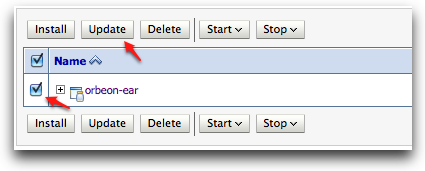
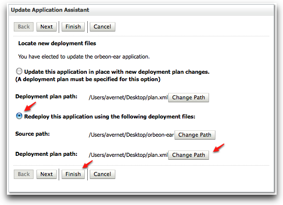

# Setting up an external resources directory

<!-- toc -->

## Rationale

In some cases, you want to keep the files from Orbeon Forms completely separate from those of your application. You want to deploy the Orbeon Forms web archive (`war`) and use it without having to make any change to any of the file inside that archive. This approach has several benefits, including:

* Upgrading (or downgrading) Orbeon Forms is easier, as you can just re-deploy an version, without having to do any further changes.
* Since you are not going to directly change any of the files inside the Orbeon Forms web archive, you can look at it as one module, and don't need to worry at all about any of the files it contains.

## How it works

Orbeon Forms uses [resource managers][1] to load most of the files that configure or implement your forms. You can use different resource managers, which look for files in different places, say in a sub-directory inside the web archive (e.g. `WEB-INF/resources`), or from the class path (e.g. inside jar files), or in a specific directory on disk. Different resources managers can also be chained, so you can configure Orbeon Forms to look for in location A first, and then in location B next. This is configured with context parameters, which you typically set in the `WEB-INF/web.xml`.

To be able to override resources that come with Orbeon Forms without changing any of the files inside the web archive:

1. Create a directory on disk, in which you put the resources you want to override. Let's assume this directory is `/home/myapp/resources`. So if you want to override properties, you create your own `/home/myapp/resources/config/properties-local.xml`. To deploy your PE license, place it in `/home/myapp/resources/config/license.xml`.
2. You will instruct Orbeon Forms to first try using a resource manager that is file system based, and that looks for resources in the base directory `/home/myapp/resources`. This is done by setting the following two context parameters:
    * First added context parameter:
        * Name: `oxf.resources.priority.0`
        * Value: `org.orbeon.oxf.resources.FilesystemResourceManagerFactory`
    * Second added context parameter:
        * Name: `oxf.resources.priority.0.oxf.resources.filesystem.sandbox-directory`
        * Value: `/home/myapp/resources`

You typically set context parameters in the `web.xml`, but don't want to do so here, as you don't want to change _any_ of the files inside the web archive. So you will be setting those context parameters at the application server level, and the way you do this depends on what application server you use. See the section below that corresponds to your application server.


## With Tomcat

In Tomcat's `server.xml`, add the two `<parameter>` elements to the `<context>` you have there for Orbeon Forms (add a `<context>` for Orbeon Forms, if you don't have one already):

```xml
<Context
        path="/orbeon"
        docBase="path/to/orbeon-war"
        reloadable="false"
        override="true"
        crossContext="true">
    <Parameter
        override="false"
        name="oxf.resources.priority.0"
        value="org.orbeon.oxf.resources.FilesystemResourceManagerFactory"/>
    <Parameter
        override="false"
        name="oxf.resources.priority.0.oxf.resources.filesystem.sandbox-directory"
        value="/home/myapp/resources"/>
</Context>
```

## With WebLogic

This assumes that you are deploying Orbeon Forms in WebLogic as an enterprise archive (`ear`), as described in [Installation with WebLogic](FIXME Installation ~ WebLogic).

1. Save the XML file below in to an XML file (say `plan.xml`). This is going to be your WebLogic deployment plan. You keep it in a directory if your choice, separate from Orbeon Forms. (If you are already using a deployment for Orbeon Forms, then amend as appropriate.)

    ```xml
    <?xml version='1.0' encoding='UTF-8'?>
    <deployment-plan xmlns="http://xmlns.oracle.com/weblogic/deployment-plan"
                     xmlns:xsi="http://www.w3.org/2001/XMLSchema-instance"
                     xsi:schemaLocation="http://xmlns.oracle.com/weblogic/deployment-plan http://xmlns.oracle.com/weblogic/deployment-plan/1.0/deployment-plan.xsd"
                     global-variables="false">
        <application-name>orbeon-ear</application-name>
        <variable-definition>
            <variable>
                <name>filesystem_resource_manager</name>
                <value>org.orbeon.oxf.resources.FilesystemResourceManagerFactory</value>
            </variable>
            <variable>
                <name>filesystem_sandbox_directory</name>
                <value>/home/myapp/resources</value>
            </variable>
        </variable-definition>
        <module-override>
            <module-name>orbeon</module-name>
            <module-type>war</module-type>
            <module-descriptor external="false">
                <root-element>web-app</root-element>
                <uri>WEB-INF/web.xml</uri>
                <variable-assignment>
                    <name>filesystem_resource_manager</name>
                    <xpath>/web-app/context-param/[param-name="oxf.resources.priority.0"]/param-value</xpath>
                    <operation>add</operation>
                </variable-assignment>
                <variable-assignment>
                    <name>filesystem_sandbox_directory</name>
                    <xpath>/web-app/context-param/[param-name="oxf.resources.priority.0.oxf.resources.filesystem.sandbox-directory"]/param-value</xpath>
                    <operation>add</operation>
                </variable-assignment>
            </module-descriptor>
        </module-override>
    </deployment-plan>
    ```


2. From the WebLogic Console, under _Deployments_, click the checkbox next to _orbeon-ear_, and click on the _Update_ button.

    

3. On the next screen, choose _Redeploy the application using the following deployment files_. The _Source path_ will most likely be pre-populated with the path in which you have your Orbeon Forms enterprise archive (exploded or as an `ear` file). For the _Deployment plan path_, select the file you created in step 1. Click _Finish_ to redeploy Orbeon Forms taking into account the context parameters set in the deployment plan.

    

Step 2 and 3 above assume you use the WebLogic Console to deploy Orbeon Forms. If instead you use `java weblogic.Deployer`, on the command line, just add the following parameter to the command you normally use to deploy Orbeon Forms: `-plan plan.xml`.

[1]: http://wiki.orbeon.com/forms/doc/developer-guide/resource-managers
